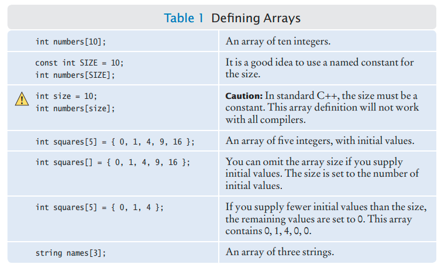

# C++ Notes

## Other Resources

[A Complete Guide to Programming in C++](http://www.lmpt.univ-tours.fr/~volkov/C++.pdf) (Book)

[Programming and Data Structures](https://eecs280staff.github.io/notes/index.html)

[Learn C++ Programming -Beginner to Advance - Deep Dive in C++](https://www.udemy.com/course/cpp-deep-dive/)

[C++ Programming Course](https://www.youtube.com/watch?v=8jLOx1hD3_o) (freeCodeCamp)

[Cherno's C++](https://www.youtube.com/playlist?list=PLlrATfBNZ98dudnM48yfGUldqGD0S4FFb) (YouTube Series)

# C++ - Intro

C++ is a high level object-oriented programing language.

Most C++ compilers require that C++ files end in an extension .cpp, .cxx, .cc, or .c.

C++ language is case sensitive.

## Library

A library is a collection of code that has been programmed and translated by someone else, ready for you to use in your program.

## Compiler

A compiler translates the written code into machine code.

## Linker

A linker takes your machine code and the necessary parts from the C++ library and builds an executable file.


## C++ skeleton code

```cpp
#include <iostream> //Preprocessor directive
using namespace std;
int main()
{
  // Enter code here
  return 0;
}
```

## C++ File Types

| File Type        | File extension | Description                                              |
| ---------------- | -------------- | -------------------------------------------------------- |
| Source code file | .cpp           | Text file containing the c++ code.                       |
| Header file      | .h             | Text file containing information about other code files. |
| Object File      | .obj           | File containing object code.                             |
| Executable       | .exe           | Executable binary file.                                  |

### What is object code?

Object code is a portion of machine code that has not yet been linked into a complete program.

## Preprocessor Directive

- This directs the compiler to include a source file before compiling the program.
- Generally used to include header files with extension .h. For example iostream.h.

### Explaining #include \<iostream\>

|  Symbol  |                              Description                               |
| :------: | :--------------------------------------------------------------------: |
|    \#    |                         Preprocessor Directive                         |
| iostream | Header file provided by the C/C++ language for input/output processing |
|    <>    |      Means that this file is available in a predefined directory       |

# C++ Escape Sequence

Backslash ' \ ' is used to print special characters.

<!--  -->

| Escape Sequence |     Description      |
| :-------------: | :------------------: |
|       \'        |     single quote     |
|       \"        |     double quote     |
|       \?        |    question mark     |
|       \\\       |      backslash       |
|       \a        |     audible bell     |
|       \b        |      backspace       |
|       \f        | form feed - new page |
|       \n        | line feed - newline  |
|       \r        |   carriage return    |
|       \t        |    horizontal tab    |
|       \v        |     vertical tab     |

# Errors

### Compile-Time Error or Syntax Error

Syntax errors occur when the compiler finds something wrong when it comes to the language rules i,e. syntax. When the compiler finds one or more errors, it will not translate the program to machine code.
If the compiler finds an error, it will not simply stop and give up. It will try to report as many errors as it can find, so you can fix them all at once.

### Run-Time Error

Run-Time error occurs when the program is syntactically correct  but it doesn’t do what it is supposed to do.
Because run-time errors are caused by logical flaws in the program, they are often called **logic errors**.
Run-time errors are more troublesome as the compiler will not be able to find them.

## Pseudocode

Pseudocode is a plain language description of the steps in an algorithm.
There are no strict requirements for pseudocode because it is read by human readers, not a computer program.

## ASCII (**American Standard Code for Information Interchange**)

[](https://www.lookuptables.com/text/ascii-table)

<!--
# Number System


[Basics of Computers - Number System](https://www.tutorialspoint.com/basics_of_computers/basics_of_computers_number_system.htm)

[Number System Conversion](https://www.tutorialspoint.com/basics_of_computers/basics_of_computers_number_system_conversion.htm)

[Real Numbers and Floating-Point Representation.pdf](data/3.1.3_Real_Numbers_and_Floating-Point_Representation.pdf)
-->

# Writing Numbers in C++

- For Hexadecimal use: `\x`
- For Octal use: `\0`
- For decimal values use: `static_cast<char>()`

# Tokens

A token is the smallest element of a C++ program that is meaningful to the compiler.

The C++ compiler recognizes these kinds of tokens:

- Identifiers
- Keywords
- Constants/Literals
- Operators
- Punctuators
- Other Separators

[C++ Tokens | Keywords, Identifiers, Literals, Punctuators, Operators - cppforschool](http://www.cppforschool.com/tutorial/basic.html)

[C/C++ Tokens - GeeksforGeeks](https://www.geeksforgeeks.org/cc-tokens/)

## Identifiers

Identifiers are used as the general terminology for naming of variables, functions and arrays. Identifier names must differ in **spelling** and **case** from any keywords. You cannot use keywords as identifiers; they are reserved for special use. Once declared, you can use the identifier in later program statements to refer to the associated value

### Rules for naming identifier:

- It must begin with a letter or underscore(_).
- It must consist of only letters, digits, or underscore. No other special character is allowed.
- It should not be a keyword.
- It must not contain white space.
- It must not start with a digit.

## Keywords

Keywords are pre-defined or reserved words in a programming language. Each keyword is meant to perform a specific function in a program. 

Since keywords are referred names for a compiler, they can’t be used as variable names because by doing so, we are introducing ambiguity.

|                         |                        |                             |
| ----------------------- | ---------------------- | --------------------------- |
| alignas (since C++11)   | explicit               | signed                      |
| alignof (since C++11)   | export(1)              | sizeof                      |
| and                     | extern                 | static                      |
| and_eq                  | FALSE                  | static_assert (since C++11) |
| asm                     | float                  | static_cast                 |
| auto(1)                 | for                    | struct                      |
| bitand                  | friend                 | switch                      |
| bitor                   | goto                   | template                    |
| bool                    | if                     | this                        |
| break                   | inline                 | thread_local (since C++11)  |
| case                    | int                    | throw                       |
| catch                   | long                   | TRUE                        |
| char                    | mutable                | try                         |
| char16_t (since C++11)  | namespace              | typedef                     |
| char32_t (since C++11)  | new                    | typeid                      |
| class                   | noexcept (since C++11) | typename                    |
| compl                   | not                    | union                       |
| concept (concepts TS)   | not_eq                 | unsigned                    |
| const                   | nullptr (since C++11)  | using(1)                    |
| constexpr (since C++11) | operator               | virtual                     |
| const_cast              | or                     | void                        |
| continue                | or_eq                  | volatile                    |
| decltype (since C++11)  | private                | wchar_t                     |
| default(1)              | protected              | while                       |
| delete(1)               | public                 | xor                         |
| do                      | register               | xor_eq                      |
| double                  | reinterpret_cast       |                             |
| dynamic_cast            | requires (concepts TS) |                             |
| else                    | return                 |                             |
| enum                    | short                  |                             |

[Source](https://en.cppreference.com/w/cpp/keyword)

## Literals

<!--  -->

### Decimal (Base 10)

- Integer constant (eg: 25, -64, 0)
- Floating point constant (eg: 2.34, -9.12, 1.2E10)

### Octal (Base 8)

- Must begin with '0' (eg -12, 056)

### Hexadecimal (Base 16)

- Must begin with '0x' (eg: 0x123)

### Character constant

- Must be written with single quotes (eg: 'A', '$')

### String constant

- Must be written with double quotes (eg: "LUMS")
- Strings always end with a `\0` delimiter

### Literal vs Identifier (informal)

Literal is the **raw value** and identifier is the **name** of the variable or constant in which that raw value is stored.

## Operators

Operators are symbols that triggers an action when applied to variables and other objects.

### Arithmetic Operators

| Operator |  Description   |
| :------: | :------------: |
|    +     |    Addition    |
|    -     |  Subtraction   |
|    *     | Multiplication |
|    /     |    Division    |
|    %     |    Modulus     |

### Increment and Decrement Operators

| Operator | Description |
| :------: | :---------: |
|    ++    |  Increment  |
|    −−    |  Decrement  |

### Relational Operators

| Operator |       Description        |
| :------: | :----------------------: |
|    ==    |       Is equal to        |
|    !=    |     Is not equal to      |
|    >     |       Greater than       |
|    <     |        Less than         |
|    >=    | Greater than or equal to |
|    <=    |  Less than or equal to   |

### Logical Operators

| Operator |                                                                                    Description                                                                                     |
| :------: | :--------------------------------------------------------------------------------------------------------------------------------------------------------------------------------: |
|    &&    | And operator. Performs logical conjunction of two expressions.(if both expressions evaluate to True, result is True. If either expression evaluates to False, the result is False) |
|   \|\|   |                        Or operator. Performs a logical disjunction on two expressions.(if either or both expressions evaluate to True, the result is True)                         |
|    !     |                                                             Not operator. Performs logical negation on an expression.                                                              |

### Bitwise Operators

Used on the **bits** of data.

| Operator |           Description            |
| :------: | :------------------------------: |
|    <<    |    Binary Left Shift Operator    |
|    !=    |         Is not equal to          |
|    >>    |   Binary Right Shift Operator    |
|    ~     | Binary One's Complement Operator |
|    &     |       Binary AND Operator        |
|    ^     |       Binary XOR Operator        |
|    \|    |        Binary OR Operator        |

### Assignment Operators

| Operator |           Description           |
| :------: | :-----------------------------: |
|    =     |             Assign              |
|    +=    |     Increments, then assign     |
|    -=    |     Decrements, then assign     |
|    *=    |     Multiplies, then assign     |
|    /=    |      Divides, then assign       |
|    %=    |      Modulus, then assign       |
|   <<=    |      Left shift and assign      |
|   >>=    |     Right shift and assign      |
|    &=    |       Bitwise AND assign        |
|    ^=    | Bitwise exclusive OR and assign |
|   \|=    | Bitwise inclusive OR and assign |

### Misc Operators

| Operator |               Description                |
| :------: | :--------------------------------------: |
|    ,     |              Comma operator              |
| sizeOf() |  Returns the size of a memory location   |
|    &     | Returns the address of a memory location |
|    *     |          Pointer to a variable           |
|   ? :    |          Conditional Expression          |

### Operator Precedence

<!--  -->

<table>

<tbody><tr>
<th style="text-align: left"> Precedence
</th>
<th style="text-align: left"> Operator
</th>
<th style="text-align: left"> Description
</th>
<th style="text-align: left"> Associativity
</th></tr>
<tr>
<th> 1
</th>
<td> <code>::</code>
</td>
<td> <a href="https://en.cppreference.com/w/cpp/language/identifiers#Qualified_identifiers" title="cpp/language/identifiers">Scope resolution</a>
</td>
<td style="vertical-align: top" rowspan="6"> Left-to-right
</td></tr>
<tr>
<th rowspan="5"> 2
</th>
<td style="border-bottom-style: none"> <code>a++</code>   <code>a--</code>
</td>
<td style="border-bottom-style: none"> Suffix/postfix <a href="https://en.cppreference.com/w/cpp/language/operator_incdec" title="cpp/language/operator incdec">increment and decrement</a>
</td></tr>
<tr>
<td style="border-bottom-style: none; border-top-style: none"> <code><i>type</i>()</code>   <code><i>type</i>{}</code>
</td>
<td style="border-bottom-style: none; border-top-style: none"> <a href="https://en.cppreference.com/w/cpp/language/explicit_cast" title="cpp/language/explicit cast">Functional cast</a>
</td></tr>
<tr>
<td style="border-bottom-style: none; border-top-style: none"> <code>a()</code>
</td>
<td style="border-bottom-style: none; border-top-style: none"> <a href="https://en.cppreference.com/w/cpp/language/operator_other#Built-in_function_call_operator" title="cpp/language/operator other">Function call</a>
</td></tr>
<tr>
<td style="border-bottom-style: none; border-top-style: none"> <code>a[]</code>
</td>
<td style="border-bottom-style: none; border-top-style: none"> <a href="https://en.cppreference.com/w/cpp/language/operator_member_access#Built-in_subscript_operator" title="cpp/language/operator member access">Subscript</a>
</td></tr>
<tr>
<td style="border-bottom-style: none; border-top-style: none"> <code>.</code>   <code>-></code>
</td>
<td style="border-bottom-style: none; border-top-style: none"> <a href="https://en.cppreference.com/w/cpp/language/operator_member_access#Built-in_member_access_operators" title="cpp/language/operator member access">Member access</a>
</td></tr>
<tr>
<th rowspan="10"> 3
</th>
<td style="border-bottom-style: none"> <code>++a</code>   <code>--a</code>
</td>
<td style="border-bottom-style: none"> Prefix <a href="https://en.cppreference.com/w/cpp/language/operator_incdec" title="cpp/language/operator incdec">increment and decrement</a>
</td>
<td style="vertical-align: top" rowspan="10"> Right-to-left
</td></tr>
<tr>
<td style="border-bottom-style: none; border-top-style: none"> <code>+a</code>   <code>-a</code>
</td>
<td style="border-bottom-style: none; border-top-style: none"> Unary <a href="https://en.cppreference.com/w/cpp/language/operator_arithmetic#Unary_arithmetic_operators" title="cpp/language/operator arithmetic">plus and minus</a>
</td></tr>
<tr>
<td style="border-bottom-style: none; border-top-style: none"> <code>!</code>   <code>~</code>
</td>
<td style="border-bottom-style: none; border-top-style: none"> <a href="https://en.cppreference.com/w/cpp/language/operator_logical" title="cpp/language/operator logical">Logical NOT</a> and <a href="https://en.cppreference.com/w/cpp/language/operator_arithmetic#Bitwise_logic_operators" title="cpp/language/operator arithmetic">bitwise NOT</a>
</td></tr>
<tr>
<td style="border-bottom-style: none; border-top-style: none"> <code>(<i>type</i>)</code>
</td>
<td style="border-bottom-style: none; border-top-style: none"> <a href="https://en.cppreference.com/w/cpp/language/explicit_cast" title="cpp/language/explicit cast">C-style cast</a>
</td></tr>
<tr>
<td style="border-bottom-style: none; border-top-style: none"> <code>*a</code>
</td>
<td style="border-bottom-style: none; border-top-style: none"> <a href="https://en.cppreference.com/w/cpp/language/operator_member_access#Built-in_indirection_operator" title="cpp/language/operator member access">Indirection</a> (dereference)
</td></tr>
<tr>
<td style="border-bottom-style: none; border-top-style: none"> <code>&a</code>
</td>
<td style="border-bottom-style: none; border-top-style: none"> <a href="https://en.cppreference.com/w/cpp/language/operator_member_access#Built-in_address-of_operator" title="cpp/language/operator member access">Address-of</a>
</td></tr>
<tr>
<td style="border-bottom-style: none; border-top-style: none"> <code>sizeof</code>
</td>
<td style="border-bottom-style: none; border-top-style: none"> <a href="https://en.cppreference.com/w/cpp/language/sizeof" title="cpp/language/sizeof">Size-of</a>
</td></tr>
<tr>
<td style="border-bottom-style: none; border-top-style: none"> <code>co_await</code>
</td>
<td style="border-bottom-style: none; border-top-style: none"> <a href="https://en.cppreference.com/w/cpp/language/coroutines" title="cpp/language/coroutines">await-expression</a> <span class="t-mark-rev t-since-cxx20">(C++20)</span>
</td></tr>
<tr>
<td style="border-bottom-style: none; border-top-style: none"> <code>new</code>   <code>new[]</code>
</td>
<td style="border-bottom-style: none; border-top-style: none"> <a href="https://en.cppreference.com/w/cpp/language/new" title="cpp/language/new">Dynamic memory allocation</a>
</td></tr>
<tr>
<td style="border-top-style: none"> <code>delete</code>   <code>delete[]</code>
</td>
<td style="border-top-style: none"> <a href="https://en.cppreference.com/w/cpp/language/delete" title="cpp/language/delete">Dynamic memory deallocation</a>
</td></tr>
<tr>
<th> 4
</th>
<td> <code>.*</code>   <code>->*</code>
</td>
<td> <a href="https://en.cppreference.com/w/cpp/language/operator_member_access#Built-in_pointer-to-member_access_operators" title="cpp/language/operator member access">Pointer-to-member</a>
</td>
<td style="vertical-align: top" rowspan="12"> Left-to-right
</td></tr>
<tr>
<th> 5
</th>
<td> <code>a*b</code>   <code>a/b</code>   <code>a%b</code>
</td>
<td> <a href="https://en.cppreference.com/w/cpp/language/operator_arithmetic#Multiplicative_operators" title="cpp/language/operator arithmetic">Multiplication, division, and remainder</a>
</td></tr>
<tr>
<th> 6
</th>
<td> <code>a+b</code>   <code>a-b</code>
</td>
<td> <a href="https://en.cppreference.com/w/cpp/language/operator_arithmetic#Additive_operators" title="cpp/language/operator arithmetic">Addition and subtraction</a>
</td></tr>
<tr>
<th> 7
</th>
<td> <code><<</code>   <code>>></code>
</td>
<td> Bitwise <a href="https://en.cppreference.com/w/cpp/language/operator_arithmetic#Bitwise_shift_operators" title="cpp/language/operator arithmetic">left shift and right shift</a>
</td></tr>
<tr>
<th> 8
</th>
<td> <code><=></code>
</td>
<td> <a href="https://en.cppreference.com/w/cpp/language/operator_comparison#Three-way_comparison" title="cpp/language/operator comparison">Three-way comparison operator</a> <span class="t-mark-rev t-since-cxx20">(since C++20)</span>
</td></tr>
<tr>
<th> 9
</th>
<td> <code><</code>   <code><=</code>   <code>></code>   <code>>=</code>
</td>
<td> For <a href="https://en.cppreference.com/w/cpp/language/operator_comparison" title="cpp/language/operator comparison">relational operators</a> < and ≤ and > and ≥ respectively
</td></tr>
<tr>
<th> 10
</th>
<td> <code>==</code>   <code>!=</code>
</td>
<td> For <a href="https://en.cppreference.com/w/cpp/language/operator_comparison" title="cpp/language/operator comparison">equality operators</a> = and ≠ respectively
</td></tr>
<tr>
<th> 11
</th>
<td> <code>&</code>
</td>
<td> <a href="https://en.cppreference.com/w/cpp/language/operator_arithmetic#Bitwise_logic_operators" title="cpp/language/operator arithmetic">Bitwise AND</a>
</td></tr>
<tr>
<th> 12
</th>
<td> <code>^</code>
</td>
<td> <a href="https://en.cppreference.com/w/cpp/language/operator_arithmetic#Bitwise_logic_operators" title="cpp/language/operator arithmetic">Bitwise XOR</a> (exclusive or)
</td></tr>
<tr>
<th> 13
</th>
<td> <code>|</code>
</td>
<td> <a href="https://en.cppreference.com/w/cpp/language/operator_arithmetic#Bitwise_logic_operators" title="cpp/language/operator arithmetic">Bitwise OR</a> (inclusive or)
</td></tr>
<tr>
<th> 14
</th>
<td> <code>&&</code>
</td>
<td> <a href="https://en.cppreference.com/w/cpp/language/operator_logical" title="cpp/language/operator logical">Logical AND</a>
</td></tr>
<tr>
<th> 15
</th>
<td> <code>||</code>
</td>
<td> <a href="https://en.cppreference.com/w/cpp/language/operator_logical" title="cpp/language/operator logical">Logical OR</a>
</td></tr>
<tr>
<th rowspan="8"> 16
</th>
<td style="border-bottom-style: none"> <code>a?b:c</code>
</td>
<td style="border-bottom-style: none"> <a href="https://en.cppreference.com/w/cpp/language/operator_other#Conditional_operator" title="cpp/language/operator other">Ternary conditional</a>
</td>
<td style="vertical-align: top" rowspan="8"> Right-to-left
</td></tr>
<tr>
<td style="border-bottom-style: none; border-top-style: none"> <code>throw</code>
</td>
<td style="border-bottom-style: none; border-top-style: none"> <a href="https://en.cppreference.com/w/cpp/language/throw" title="cpp/language/throw">throw operator</a>
</td></tr>
<tr>
<td style="border-bottom-style: none; border-top-style: none"> <code>co_yield</code>
</td>
<td style="border-bottom-style: none; border-top-style: none"> <a href="https://en.cppreference.com/w/cpp/language/coroutines" title="cpp/language/coroutines">yield-expression</a> <span class="t-mark-rev t-since-cxx20">(C++20)</span>
</td></tr>
<tr>
<td style="border-bottom-style: none; border-top-style: none"> <code>=</code>
</td>
<td style="border-bottom-style: none; border-top-style: none"> <a href="https://en.cppreference.com/w/cpp/language/operator_assignment#Builtin_direct_assignment" title="cpp/language/operator assignment">Direct assignment</a> (provided by default for C++ classes)
</td></tr>
<tr>
<td style="border-bottom-style: none; border-top-style: none"> <code>+=</code>   <code>-=</code>
</td>
<td style="border-bottom-style: none; border-top-style: none"> <a href="https://en.cppreference.com/w/cpp/language/operator_assignment#Builtin_compound_assignment" title="cpp/language/operator assignment">Compound assignment</a> by sum and difference
</td></tr>
<tr>
<td style="border-bottom-style: none; border-top-style: none"> <code>*=</code>   <code>/=</code>   <code>%=</code>
</td>
<td style="border-bottom-style: none; border-top-style: none"> <a href="https://en.cppreference.com/w/cpp/language/operator_assignment#Builtin_compound_assignment" title="cpp/language/operator assignment">Compound assignment</a> by product, quotient, and remainder
</td></tr>
<tr>
<td style="border-bottom-style: none; border-top-style: none"> <code><<=</code>   <code>>>=</code>
</td>
<td style="border-bottom-style: none; border-top-style: none"> <a href="https://en.cppreference.com/w/cpp/language/operator_assignment#Builtin_compound_assignment" title="cpp/language/operator assignment">Compound assignment</a> by bitwise left shift and right shift
</td></tr>
<tr>
<td style="border-top-style: none"> <code>&=</code>   <code>^=</code>   <code>|=</code>
</td>
<td style="border-top-style: none"> <a href="https://en.cppreference.com/w/cpp/language/operator_assignment#Builtin_compound_assignment" title="cpp/language/operator assignment">Compound assignment</a> by bitwise AND, XOR, and OR
</td></tr>
<tr>
<th> 17
</th>
<td> <code>,</code>
</td>
<td> <a href="https://en.cppreference.com/w/cpp/language/operator_other#Built-in_comma_operator" title="cpp/language/operator other">Comma</a>
</td>
<td> Left-to-right
</td></tr></tbody></table>

[Source](https://en.cppreference.com/w/cpp/language/operator_precedence)

## Punctuators

<!---->

| Punctuator  | Symbol | Description                                                                                            |
| ----------- | ------ | ------------------------------------------------------------------------------------------------------ |
| Brackets    | `[]`   | Opening and closing brackets indicate single and multidimensional array subscript.                     |
| Parentheses | `()`   | Opening and closing parentheses indicate function calls; function parameters for grouping expressions. |
| Braces      | `{}`   | Opening and closing braces indicate start and end of a compound statement.                             |
| Comma       | `,`    | It is used as a separator is a function argument list.                                                 |
| Semicolon   | `;`    | It is used as a statement terminator.                                                                  |
| Colon       | `:`    | It indicates a labeled statement or conditional operator symbol.                                       |
| Asterisk    | `*`    | It is used in pointer declaration and dereferencing and as multiplication operator.                    |
| Equal sign  | `=`    | It is used as an assignment operator.                                                                  |
| Pound sign  | `#`    | It is used as a preprocessor directive.                                                                |

# Important operators

## The Division operator ( / ) (C++ specific)

Division ( / ) usually return the quotient value, or in other words if used with integers, will give answer in integers too i.e. 5 / 2 = 2.

If you want the result in decimal form you can do:

1. `5 / 2.0`
2. `(double)5 / 2` i.e. type casting
3. `double a = 5, b = 2, c; c = a / b` i.e. division on decimal defined values

## The MOD (%) operator

Modulus ( % ) gives us the remainder i.e. 5 % 2 = 1

## Separating numbers using MOD and Division

```cpp
// Separate Last 2 Character

int a = 428;
a = a % 100;

cout << a << endl;
// Output: 28
```

```cpp
// Separate First 2 Character

int a = 938;
a = a / 10;

cout << a << endl;
// Output: 93
```

## Increment and Decrement Operator

```cpp
++x; // increment first or pre increment
x++; // increment later ot post increment

// Example 1
x = 3;
y = ++x;
// x contains 4, y contains 4

// Example 2
x = 3;
y = x++;
// x contains 4, y contains 3

// Example 3 
x = 1;
y = x++ + 1;
// x contains 2, y contains 2
```

## The `sizeof`operator

[Discussed here](#sizeof)

# Naming Convention for C++

|  Object   |       Convention        |
| :-------: | :---------------------: |
| Constants |    ALL_CAPS, ALLCAPS    |
| Variables |   all_small, allsmall   |
| Functions | firstSmallRestCamelCase |
|  Classes  |        CamelCase        |

[Google C++ Style Guide](https://google.github.io/styleguide/cppguide.html#Naming)

# Variable

An identifier whose value can be modified or changed.

## Variable definition and assignment

```cpp
int number;
// Declaration statement

number = 8; 
// Assignment statement


int another_number = 6;
// Variable definition (declaration + assignment)
```

You must define a variable before you use it for the first time.

## Using Uninitialized Variables

If you define a variable but leave it uninitialized, then your program can act unpredictably. If you use the variable without initializing it, then a default value will be used, yielding unpredictable results. For example, consider the program segment:

```cpp
int bottles; // Forgot to initialize
int bottle_volume = bottles * 2; // Result is unpredictable
```

# Constants

- An identifier whose value cannot be modified or changed. They are treated just like regular variables except that their values cannot be modified after their definition.
- Its better to use UPPERCASE for names of constant.
- A constant can be declared using the keyword `const` as:

```cpp
const int CANS_PER_PACK = 6;
const float PI = 3.14159;
const char FIRST_CH = 'c';
const string PREFIX = "LUMS";
```

# Comments

```cpp
const double CAN_VOLUME = 0.355; // Single line comment

/*
 This is a
 multiline comment
*/
```

# C++ Data Types

| Simple/Basic | Modifiers | Qualifiers | Derived (Structured) | Composite (Advanced) |
| :----------: | :-------: | :--------: | :------------------: | :------------------: |
|     char     |  signed   |   static   |        arrays        |        lists         |
|     int      | unsigned  |   const    |      structures      |        queues        |
|    float     |   long    |  volatile  |        unions        |        stacks        |
|    double    |     -     |    void    |       classes        |        trees         |
|      -       |     -     |     -      |          -           |        graphs        |

[**Size Chart**](https://docs.oracle.com/cd/E19253-01/817-6223/chp-typeopexpr-2/index.html)

# Character (char)

`char` is used to store a single character within single quotes ( `' '` ).

```cpp
char x = 'x';
char z = '\n';
```

Char is actually an integer in the backend and can be used to make a program more efficient.

[Difference between signed / unsigned char](https://stackoverflow.com/questions/4337217/difference-between-signed-unsigned-cha)

# Numeric Types

<!---->

|      Type      |                          Range                           |  Size   |
| :------------: | :------------------------------------------------------: | :-----: |
|      int       |             -2,147,483,648 ... 2,147,483,647             | 4 bytes |
|    unsigned    |                   0 ... 4,294,967,295                    | 4 bytes |
|     short      |                    -32,768 ... 32,767                    | 2 bytes |
| unsigned short |                       0 ... 65,535                       | 2 bytes |
|   long long    | -9,223,372,036,854,775,808 ... 9,223,372,036,854,775,807 | 8 bytes |
|     double     |             Double-precision floating-point              | 8 bytes |
|     float      |             Single-precision floating point              | 4 bytes |

[**A better size chart here**](https://docs.oracle.com/cd/E19253-01/817-6223/chp-typeopexpr-2/index.html)

## Can double hold store data than long?

Double is a floating point data type while long is an integral data type. The difference is in the manner of encoding number information.

The 64 bit double format based on IEEE754 standard has the following breakup:

- Sign bit: 1 bit
- Exponent width: 11 bits
- Significant precision: 53 bits (52 explicitly stored)

[Source](https://en.wikipedia.org/wiki/Double-precision_floating-point_format)

The exponent gives double precision numbers a very large range - Negative numbers are in the range -1.79769e+308 to -2.22507e-308 and positive numbers are in the range 2.22507e-308 to 1.79769e+308.

The large range comes at the cost of decreased precision though.

64bit long in contrast has a simple encoding, it is represented as a string of bits in the binary numeral system. These can range from −2^63 to 2^63 − 1 in the signed case. Or from 0 to 2^64 -1 in the unsigned case.

Note that 'long' may imply either 32 bit or 64 bit depending on the context. Im assuming you mean 64bit long here.

## Numeric Ranges, Precisions and Overflows

Because numbers are represented in the computer with a limited number of digits, they cannot represent arbitrary integer or floating-point numbers.  All data type have a limited range. 

If a computation yields a value that is outside the `int` range, the variable will **overflow**. 

If a variable is currently at the highest possible value it can store, and you add 1 to it, it will cycle back to the smallest possible value.

For floating-points, a computer can not store the exact value of a fraction and can only store a close approximation. This is called **Roundoff Error**. How precise that approximation, depends on the size of the data type.

## Calculating range of a 32bit integer

$$
-\frac{2^{32}}{2} \iff 0 \iff \frac{2^{32}}{2}-1
$$

$$
-2147483648 \iff 0 \iff 2147483647
$$

> 0 is considered a positive number. Thus, 1 is subtracted from the total number of positive integers when calculating total range of positive numbers.

## Storing floats in int

```cpp
// int just ignores everything after the decimal - truncation
int x = 2.7523532425; 
// x = 2
int x = 2.023532425; 
// x = 2
```

## Floating Point Literals

[floating literal - cppreference](https://en.cppreference.com/w/cpp/language/floating_literal)

## Declaring a float variable explicitly

Floats are not usually used nowadays but if you want to explicitly use a float, declare it with a `f` suffix.

```cpp
float = 2.45f;
// the f at the end is necessary, else the compiler will change the float to a double
```

# `auto` Data Type

[auto cpp - Microsoft](https://docs.microsoft.com/en-us/cpp/cpp/auto-cpp)

# `sizeof`

The `sizeof` is a keyword, but it is a compile-time operator that determines the size, in bytes, of a variable or data type.

The sizeof operator can be used to get the size of classes, structures, unions and any other user defined data types.

It is mainly used to get size of arrays.

```cpp
#include <iostream>
using namespace std;

int main() {
   cout << "Size of char : " << sizeof(char) << endl;
   cout << "Size of int : " << sizeof(int) << endl;
   cout << "Size of short int : " << sizeof(short int) << endl;
   cout << "Size of long int : " << sizeof(long int) << endl;
   cout << "Size of float : " << sizeof(float) << endl;
   cout << "Size of double : " << sizeof(double) << endl;
   cout << "Size of wchar_t : " << sizeof(wchar_t) << endl;

   return 0;
}
/*
Size of char : 1
Size of int : 4
Size of short int : 2
Size of long int : 4
Size of float : 4
Size of double : 8
Size of wchar_t : 4
*/
```

# static_cast()

`static_cast` is used to convert data types.

```cpp
// static_cast < new_type > ( expression )
int n = static_cast<int>(3.14);
```

# Input and Output

<!---->

```cpp
cout << "Enter number of bottles: "; //prompt

int bottles;
cin >> bottles; // input 
```

`cin` only reads one word. 

Example if you try to input `Double Word` with `cnn` only `Double` will be loaded. 

To take multiword inputs use `getline()`.

```cpp
string city;
getline(cin, city);
// read till the end of the line and store it in the variable city
```

## cin.fail()

`cin.fail()` is used for Input Validation. Below is an example implementation:

```cpp
int x = 0;
cin >> x;

if (cin.fail())
{
    cout << "Error: Not an integer." << endl;
    return 1; // used when the program closes due to an error
} else
{
    cout << "Input was accepted" << endl;
    return 0;
}
```

## Clearing Input Failure State

When an input operation has failed, all further input operations also fail. If you want to read two number sequences and use a letter as a sentinel, you need to clear the failure state after reading the first sentinel. Call the `cin.clear()` function.

```cpp
int values;
cout << "Enter values, Q to quit.\n";
while (cin >> values)
{
    // Process input.
}
cin.clear(); // removes errror flag

// Suppose the user has entered 30 10 5 Q. 
// The input of Q has caused the failure. Because 
// only successfully processed characters are 
// removed from the input, the Q character is 
// still present. Read it into a dummy variable.

string sentinel;
getline(cin, sentinel); // inplace of this you can also use cin.ignore(1000, '\n');

// every input after this will work fine
```

The `cin.clear()` clears the **error flag** on cin so that future I/O operations will work correctly.

NOTE: `cin.clear()` and storing the cin's data in a dummy variable have separate purposes. Also see `cin.ignore()` and `cin.flush()`.

[ios::clear - C++ Reference](http://www.cplusplus.com/reference/ios/ios/clear/)

[istream::ignore - C++ Reference](http://www.cplusplus.com/reference/istream/istream/ignore/)

# Formatted Outputs

- `fixed` - write floating point values in fixed point notation.
- `scientific` - write floating point values in scientific notation.
- `setprecision()` - set floating point precision to n decimal places.
- `setw()` - set width to n columns.
- `setfill()` - use a specific character to fill a width (specified by `setw()`).

> use iomanip header to get access to setw() and setprecision()

## Examples:

<!---->

|                  Statement                  |    Output    |                                               Comment                                                |
| :-----------------------------------------: | :----------: | :--------------------------------------------------------------------------------------------------: |
|            `cout << 12.345678;`             |  `12.3457`   |                      By default, a number is printed with 6 significant digits.                      |
| `cout << fixed << setprecision(2) << 12.3;` |   `12.30`    | Use the fixed and setprecision manipulators to control the number of digits after the decimal point. |
|       `cout << ":" << setw(6) << 12;`       |  `:    12`   |            Four spaces are printed before the number, for a total width of 6 characters.             |
|       `cout << ":" << set(2) << 123;`       |    `:123`    |                             If the width not sufficient, it is ignored.                              |
|       `cout << setw(6) << ":" << 12;`       | `     :12.3` |           The width only refers to the next item. Here, the : is preceded by five spaces.            |

## setprecision() examples

```cpp
int main () {
  double f =3.14159;
  std::cout << std::setprecision(5) << f << endl;
  std::cout << std::setprecision(9) << f << endl;
  std::cout << std::fixed;
  std::cout << std::setprecision(5) << f << endl;
  std::cout << std::setprecision(9) << f << endl;
  return 0;
}
/*
3.1416 // 5 digits
3.14159
// fixed specified here
3.14159 // fixed makes it so that 5 characters are printed after decimal
3.141590000 // here 9 digits are printed after the decimal
*/
```

## `setw()` & `setfill()` example:

```cpp
int main()
{
    cout << setfill(' ') << setw(15) << "" << setfill ('*') << setw (3) << "" << setfill(' ') << setw(15) << "" << endl;
    cout << setfill(' ') << setw(13) << "" << setfill ('*') << setw (7) << "" << setfill(' ') << setw(13) << "" << endl;
    cout << setfill(' ') << setw(11) << "" << setfill ('*') << setw (11) << "" << setfill(' ') << setw(11) << "" << endl;
    cout << setfill(' ') << setw(0) << "" << setfill ('*') << setw (33) << "" << setfill(' ') << setw(0) << "" << endl;
    cout << setfill('*') << setw(8) << "" << setfill (' ') << setw (17) << "" << setfill('*') << setw(8) << "" << endl;

    cout << "  " << setfill('*') << setw(8) << "" << setfill (' ') << setw (13) << "" << setfill('*') << setw(8) << "" << "  " << endl;
    cout << setfill('*') << setw(8) << "" << setfill (' ') << setw (17) << "" << setfill('*') << setw(8) << "" << endl;

    cout << setfill(' ') << setw(0) << "" << setfill ('*') << setw (33) << "" << setfill(' ') << setw(0) << "" << endl;
    cout << setfill(' ') << setw(11) << "" << setfill ('*') << setw (11) << "" << setfill(' ') << setw(11) << "" << endl;
    cout << setfill(' ') << setw(13) << "" << setfill ('*') << setw (7) << "" << setfill(' ') << setw(13) << "" << endl;
    cout << setfill(' ') << setw(15) << "" << setfill ('*') << setw (3) << "" << setfill(' ') << setw(15) << "" << endl;
    return 0;
}
/*
               ***               
             *******             
           ***********           
*********************************
********                 ********
  ********             ********  
********                 ********
*********************************
           ***********           
             *******             
               ***
*/
```

```cpp
int main()
{
    cout << setfill(' ') << setw(4) << "" << setfill('*') << setw(1) << "" << setfill(' ') << setw(4) << "" << endl;
    cout << setfill(' ') << setw(3) << "" << setfill('*') << setw(3) << "" << setfill(' ') << setw(3) << "" << endl;
    cout << setfill(' ') << setw(2) << "" << setfill('*') << setw(5) << "" << setfill(' ') << setw(2) << "" << endl;
    cout << setfill(' ') << setw(1) << "" << setfill('*') << setw(7) << "" << setfill(' ') << setw(1) << "" << endl;
    cout << setfill(' ') << setw(0) << "" << setfill('*') << setw(9) << "" << setfill(' ') << setw(0) << "" << endl;
    return 0;
}

/*
Output:
    *
   ***
  *****
 *******
*********
*/
```

# String

- To use string include the header file string: `#include <string>`
- Given two strings, such as "Harry" and "Morgan", you can concatenate them to one long string.

```cpp
string fname = "Harry";
string lname = "Morgan";
string name = fname + lname;
//"HarryMorgan"
```

## What is a string literal?

String literal is the raw string value like "hello".

Remember: Two string literals can not be concatenated.
However, a string literal can be concatenated with a variable with a string\char data type.

## String Functions


<!--
# Comparison Operators


## Comparison Examples


-->

# If Else statement

```cpp
if ( a < 20 ) 
{
  // if condition is true then print the following
  cout << "a is less than 20;" << endl;
}
else if ( a > 30)
{
  cout << "a is more than 30;" << endl;
}
else
{
  cout << "a is between 20 and 30;" << endl;
}


// if you have only one statement after if you can skip the {}
if ( 5 < 10 )
  cout<<"Five is now less than ten, that's a big surprise";
```

## Dangling Else

Dangling else can cause issues and can be quite difficult to debug.

```cpp
if(x == 1)
    if(x == 2)
        if(x > 2)
else //this else belongs to if(x > 2)
{
    //code
}
```

## Dynamic Declaration (C++17)

```cpp
if (int k = 5; k < 10)
{
  // k will only be useable inside 'the if' code block
}
```

# Conditional operator

```cpp
//condition ? true value : false value
actual_floor = floor > 13 ? floor - 1 : floor;
```

# Short Circuiting

C++ optimizes the comparisons by only running half of the comparisons. 

For example in `x && b` if `x` is false, the output of the comparison will be false no matter what the value of `b` is and so c++ will not even check the value of `b`. However, if `x` is true then c++ will check the value for `b` as now the output also depends on the value of `b`. 

In case of `x || b` if `x` is true, the output of the comparison will true no matter what the value of `b` is and so c++ will not check the value of `b`. But if the value of `x` is false, now the output will depend on the value of `b`. 

Analyze the following code:

```cpp
bool yes()
{
  cout << "yes";
  return true;
}

bool no()
{
  cout << "no";
  return false;
}

int main()
{
  yes() || no(); // output: yes
  no() || yes(); // output: noyes
  yes() || yes(); // output: yes
}
```

# De Morgan's Law

$$ !(A \& B)  == !A || !B $$

# Comparison of Floating-Point Numbers

Exact Comparison of Floating-Point Numbers Floating-point numbers have only a limited precision, and calculations can introduce roundoff errors.

Use the following equation to compare the Floating-Point Number:

$$ |x-y|<\epsilon $$

```cpp
double x = 2.0;
double y =  sqrt(x);

// x = 2.00000000000000000000
// y*y = 2.00000000000000044409

// Wrong way to compare

if (x == y*y)
    cout << "Comparison Working" << endl;
else
    cout << "Comparison Not Working" << endl;

// Output:
// Comparison Not Working

// Right way to compare

double epsilon = 1E-14;
if ( fabs(x - y*y) < epsilon )
    cout << "Comparison Working" << endl;
else
    cout << "Comparison Not Working" << endl;

// Output:
// Comparison Working
```

# Comparing Strings

C++ uses Lexicographic Ordering of Strings. This ordering is very similar to the way in which words are sorted in a dictionary.

The easier way to look at it is to just use the ASCII table for comparisons. The character with the lower ASCII value will be less than the character with  higher ASCII value.

# Switch Statement

```cpp
int digit = 4;
string digit_name;

switch (digit)
{
  case 1: digit_name = "one"; break; // if digit == 1
  case 2: digit_name = "two"; break;
  case 3: digit_name = "three"; break;
  case 4: digit_name = "four"; break;
  case 5: digit_name = "five"; break;
  case 6: digit_name = "six"; break;
  case 7: digit_name = "seven"; break;
  case 8: digit_name = "eight"; break;
  case 9: digit_name = "nine"; break;
  default: digit_name = ""; break;
}

cout << digit_name << endl;
// four
```

<!--
# Flowcharts Basic


## Flowchart example

```cpp
cout << "Enter an integer greater than 1: "; 
int num; 
cin >> num; 

int i = 2;
bool pr = true; 
while (i <= num / 2) 
{ 
    if (num % i == 0)
    { 
        pr = false; 
    }
  ++i;
} 
if (pr) 
    cout << "This is a prime number";
else cout << "This is not a prime number";
```


-->

# Enumerations

[Enums - Youtube](https://www.youtube.com/watch?v=x55jfOd5PEE)

```cpp
enum Colors {RED , ORANGE, BLUE};

// RED = 0
// ORANGE = 1
// BLUE = 2

Colors mycolor = RED;
int x = 0;

if ((Colors)x == mycolor)
  cout << "mycolor is RED" << endl;
else
  cout << "mycolor is not RED" << endl;
```

You can also force indexed:

```cpp
enum Colors {RED=1 , ORANGE, BLUE};
// RED = 1
// ORANGE = 2
// BLUE = 3
```

# Typedef

Used to create user-defined data types. 

With `typedef` you can rename a primitive data types to improve code readability.

```cpp
typedef int age;
// defining a new data type age, which is actually int at its core

age a1 = 16;
age a2 = 18;
// you can use the custom datatype just like any other primitive data type
```

# While Loop

```cpp
while (/* condition */) {
  /* code */
}
```

# # Do While Loop

Do While Loop is a modification of the While Loop.

The do loop is appropriate when the loop body must be executed at least once.

```cpp
do {
  /* code */
} while(/* condition */);
```

# For Loop

```cpp
for (size_t i = 0; i < count; i++) {
  /* code */
}
```

## Inner Workings of a for loop

```cpp
/*
for (a, b ,c) { body }

a : initialization
b: condition
c: updating

1. a will run at the start
2. b will run
3. loop body will run
4. c will run
5. b will run
6. loop body will run
7. c will run
8. b will run
and so on..
*/
```

## Different Shapes of For Loops

```cpp
// ***************
for (int i = 0; i < 5 ; i++)
{
  cout << i;
}
// Output: 01234

// ***************
int i = 0;
for (; i < 5 ; i++)
{
  cout << i;
}
// Output: 01234

// ***************
int i = 0;
for (; ; i++)
{
  if ( i >= 5) { break; }

  cout << i;
}
// Output: 01234

// ***************
int i = 0;
for (; ;)
{
  if ( i >= 5) { break; }

  cout << i;
  i++;
}
// Output: 01234
```

# Foreach loop

Foreach loop iterators over an array.

The number of times the loop runs, depends on the size of the array being iterated.

```cpp
int arr[] = {1, 2, 3, 4, 5};

// arr: iterable
// x: iterating variable

for(int x: arr)
{
  cout << x << endl;
}
cout << endl;

/*
12345
*/
```

## Foreach loops with reference parameters (&)

If you modify the values of an array using foreach. You must declare the iterating variable with a '&' sign.

```cpp
int arr[] = {1, 2, 3, 4, 5};

for(int &x: arr)
{
  x++;
}

//arr: {2, 3, 4, 5, 6}
```

# `break` and `continue`

- `break` statement breaks the loop

- `continue` statement goes to the next iteration o the loop.

# Random Numbers

`rand()` is used to generate random numbers.

Use `ctime` for seed generation.

```cpp
// Generating 10 random numbers between 0 and 6

srand(time(0)); // setting seed
int number = 0;

for (int i = 0; i < 10; i++)
{
    number = rand() % 6 + 1;
    cout << number << endl;
}
```

```cpp
// Generating 10 random decimals between 0 and 1

srand(time(0));
double number = 0;

for (int i = 0; i < 10; i++)
{
    number = rand() * 1.0 / RAND_MAX; // multiply by 1.0 to convert
    cout << number << endl;           // the calculation to double.
}
```

# Functions

Functions are viewed as a black box. We put in value and we get some other value or in case of void functions we perform a task.

The whole idea of a function is to break down the program into smaller parts and to reuse those smaller parts if needed.


## Function Declaration vs Definition

```cpp
// Declaration of cube_volume
double cube_volume(double side_length); // function head

int main()
{
    cube_volume(6); // function used
    return 0;
}

// Definition of cube_volume
double cube_volume(double side_length) // function head
{
 return side_length * side_length * side_length; // function body
}
```

If you declare the define the function below the `main()` function, the compiler will not be able to find the function declaration and will not compile.
To fix this, put the function declaration above the `main()`function, and put the function definition after the `main()` function.

A drawback: Whenever you change the name of a function or one of the parameter types, you need to fix it in both places: in the declaration and in the definition.

<!--
## Flowchart representation of functions

-->

## `return` statement

`return` statement **terminates** the code body and **returns** a value, if provided.

## `void` functions

`void` functions either do not return a value or return multiple values (with the use of `struct`).

> You must use a return statement, without any value, at the end of a void function

```cpp
void print(string sentence)
{
  cout << sentence << endl;

  return;
}

// return; important for termination
```

## Function Comments

You should describe your functions using comments.

```cpp
/*
 Computes the volume of a pyramid whose base is a square.
 @param height the height of the pyramid
 @param base_length the length of one side of the pyramid’s base
 @return the volume of the pyramid
*/
double pyramidVolume(double height, double base_area)
{
    return (height * base_area)/3;
}
```

## Function Overloading

Function overloading is having multiple functions declarations with the **same name** but **different parameters**.

You cannot overload function declarations that differ only by return type (the parameters must also differ).

```cpp
int add(int a, int b)
{
  return a + b;
}

int add(int a, int b, int c)
{
  return a + b + c;
}
```

## Function Templates

Generic functions (function with same body but different data types) can be turned into templates.

```cpp
// T can be any name
template <class T>
T maxim(T x, T y)
{
  return x>y ? x : y;
}

int main()
{
  cout << maxim(2, 5) << endl;
  cout << maxim(1.4, 2.6) << endl;
}

// Output:
// 5
// 2.6
```

[Function templates - cplusplus](https://www.cplusplus.com/doc/oldtutorial/templates/)

[Templates in C++ - YouTube](https://www.youtube.com/watch?v=I-hZkUa9mIs)

## Call by value

```cpp
void swap(int a, int b)
{
  int temp = a;
  a = b;
  b = temp;
  return;
}

int main()
{
  int a = 1;
  int b = 9;
  swap(a, b);
}
// Note: This function will not work
```

For the program above the machine code for `main` and `swap` live **independently** in the memory.

When main function reaches `swap` a new stack frame is created and the value of `a` and `b` is copied into the new stack frame. The `swap` function can only access the values in its stack frame. At the end of the swap function the stack frame is deleted.

## Call by address

```cpp
void swap(int* a, int* b)
{
  int temp = *a;
  *a = *b;
  *b = temp;
  return;
}

int main()
{
  int a = 1;
  int b = 9;
  swap(&a, &b);
}
```

For the program above the machine code for `main` and `swap` live **independently** in the memory.

When the `swap` function is called in `main`, instead of passing the value into the `swap` stack frame we pass the address of `a` and `b`. This gives `swap` the ability to manipulate the values these addresses point to.

## Call by reference

```cpp
void swap(int &a, int &b)
{
  int temp = a;
  a = b;
  b = temp;
  return;
}

int main()
{
  int a = 1;
  int b = 9;
  swap(a, b);
}
```

For the program above, at the time of compilation the machine code for `swap` is copied into the machine code of `main`. In other words the body of `swap` is copied into `main` at the time of compilation.

In the case of call by reference, the activation frame of `swap` is the same as the activation frame of `main`.

For this reason, call by reference is only used for simple functions. 

## Arrays and Functions

[Discussed Here](https://github.com/millionhz/cplusplus-notes#arrays-and-functions)

## Function Pointer

```cpp
void (*func)() = myFunc; // myfunc is a function
//declared func as a function pointer


func(); // calling the function 
```

## Inline Functions
`inline` is a request to the compiler to copy the function body to the place where that specific function was called.

This is done to reduce the overhead when the execution time of the function is less than the time needed for control transfer.

# Stack Frame

[Object Lifetime in C++ (Stack/Scope Lifetimes) - YouTube](https://www.youtube.com/watch?v=iNuTwvD6ciI)

- In a stack, different stack frames are present on top of each other. In order to access a stack frame at the bottom, you will have to remove (pop) the stack frames above it.
- Functions or Code Blocks are essentially stack frames.
- Variable scopes can be describes using stack frames

# Variable Scope

A variable that is defined **within a function** is visible from the point at which it is defined until the end of the block in which it was defined. This area is called the scope of the variable.

[Object Lifetime in C++ (Stack/Scope Lifetimes) - YouTube](https://www.youtube.com/watch?v=iNuTwvD6ciI)

## Global Variable vs Local Variable

Global variable is visible to the whole file, while local variables are function specific.

```cpp
double pi = 3.142; // Global Variable

double circumferenceOfCircle(int radius)
{
    return 2 * pi * radius; // Global Variable Used
}

int main()
{
    int r = 34; // Local Variable
    cout << "Radius: " << r << endl;
    cout << circumferenceOfCircle(r) << endl;
}
```

Also check:

[Scope resolution operator in C++ - GeeksforGeeks](https://www.geeksforgeeks.org/scope-resolution-operator-in-c/)

> **DON'T USE GLOBAL VARIABLES**

## Other type of scopes

- Block Scope (local within a block of code):
  
    A variable whose scope is just a small block of code. E.g `i` in for loops:
  
  ```cpp
  for(int i = 0; i < 5; i++) 
  {
      // i is only useable here
  }
  ```

- Function scope (local within a block of function):
  
    A variable which is only useable inside a function.

- File scope:
  
    A variable which is only useable inside a file.

- Program scope:
  
    A variable which is only useable inside a program. 

# Static Variables

Usually variables are destroyed after a code block finishes execution but if we define a variable, in that block, as static, it will not be destroyed.

Static elements are only created once and have a lifetime till the end of the program.

```cpp
void counter()
{
    static int count=0;
    cout << count++;
}

int main()
{
    for(int i=0;i<5;i++)
    {
        counter();
    }
}
// Output:
// 01234
```

# **Reference** (`&`)

`&` can also be used to get the address of a specific variable.

```cpp
int x = 1;
cout << &x << endl;

// 0x7ffe6c03214c
```

**A reference of a variable is essentially that variable but different name**

```cpp
int i = 5;
int &integer = i;

cout << i << endl; // 5
cout << integer << endl; // 5

integer++;
cout << i << endl; // 6
```
[Reference declaration](https://en.cppreference.com/w/cpp/language/reference)

[C++ References - tutorialspoint](https://www.tutorialspoint.com/cplusplus/cpp_references.htm)

# Arrays

Array is the collection of items of same type in contiguous memory (stack).

## Declaring an Array

**The array size must be constant.**




## `sizeof()` on arrays

Using `sizeof()` on arrays will return the total bytes needed to store that array.

```cpp
int arr[5] = {1, 2, 3, 4, 5};

cout << sizeof(arr) << endl; // 20
cout << sizeof(arr[0]) << endl; // 4
```

## Reading out of bound array

If you try to print an out of bound index of an array, the compiler will **not complain.** 

The executable will be generated but the **output** will be **unpredictable**.

```cpp
int arr[2] = {1, 2 };
cout << arr[0] << endl;
cout << arr[1] << endl;
cout << arr[2] << endl;
/*
Output:
1
2
4196448
*/
```

`sizeof()` can be used to calculate the size (number of objects in array) of an already refined array.

```cpp
int arr[] = {1, 2, 3, 4};
int size = sizeof(arr)/sizeof(int);
// int size = sizeof(arr)/sizeof(arr[0]);
cout << size << endl;
// 4
```

# Arrays and Functions

In order to work with arrays, you need to pass the size of the array also.

Or the size can be calculated using the `sizeof()` operator in certain circumstances.

```cpp
double sum(double values[], int size) // passing in size is important
{
    double total = 0;
    for (int i = 0; i < size; i++)
    {
        total = total + values[i];
    }
 return total;
}
```

By default, only the **array pointer** is **passed** to the function i.e. `name_of_array[]` is actually a pointer to the array.

The scope of the function treats the array as a pointer and thus **you can not** use things like **foreach loop on the array**.

[C++ Passing Arrays to Functions - tutorialspoint](https://www.tutorialspoint.com/cplusplus/cpp_passing_arrays_to_functions.htm)

[Passing an array by reference - StackOverflow](https://stackoverflow.com/questions/5724171/passing-an-array-by-reference)

## Constant Array Parameters

If a function doesn’t modify the values of an array parameter, it is considered a good idea to add the `const` reserved word:

`double sum(const double values[], int size)`

The `const` reserved word helps in the readability of the code, making it clear that the function keeps the elements of an array unchanged

If the implementation of the function tries to modify the array, the compiler issues a warning.

<!--
# Common Array Algorithms

## Filling an array with user inputs

```cpp
const int SIZE = 5;
int squares[SIZE];

for(int i = 0; i < SIZE; i++)
{
  cin >> squares[i];
}
```

## Making the reverse of an array

```cpp
const int SIZE = 5;
int arr[SIZE] = {1, 2, 3, 4, 5};
int reversed_arr[SIZE];

for(int i = 4; i >= 0; i--)
{
  reversed_arr[4-i] = arr[i];
}
/*
Output:
arr: 1   2   3   4   5
reversed_arr: 5   4   3   2   1
*/
```

## Sorting an array (my algorithm)

```cpp
void sort(int arr[], int size)
{
  int temp = 0;
  for(int i = 0; i < size-1; i++)
  {
    if(arr[i] > arr[i+1])
      {
         temp = arr[i];
         arr[i] = arr[i+1];
         arr[i+1] = temp;
         i = -1; //reset
      }
  }
}

int main()
{
const int SIZE = 5;
int arr[SIZE] = {-1, -32, 33, 454, 15};

sort(arr, SIZE);
}
/*
Output:
arr: -32 -1  15  33  454
*/
```

## Selection Sort

[Selection Sort - GeeksforGeeks](https://www.geeksforgeeks.org/selection-sort/)

## Linear Search

[Linear Search - GeeksforGeeks](https://www.geeksforgeeks.org/linear-search/)

## Binary Search

[Binary Search - GeeksforGeeks](https://www.geeksforgeeks.org/binary-search/)

# Multi-Dimensional Array


## Multiplication of matrices (Example)

[C++ Program to Multiply Two Matrix Using Multi-dimensional Arrays - Programiz](https://www.programiz.com/cpp-programming/examples/matrix-multiplication)

[Passing a 2D array to a C++ function - StackOverflow](https://stackoverflow.com/questions/8767166/passing-a-2d-array-to-a-c-function)
-->

# Pointers

- A variable used to store the address of some data.
- References(`&`) are managed by the compiler but pointers are directly managed by the programmer.
- A program can not access the heap directly. To use heap, it needs to make use of pointers. 

[POINTERS in C++ - Youtube](https://www.youtube.com/watch?v=DTxHyVn0ODg)


```cpp
int x = 1000; // a variable x storing the value 1000
int* px = &x; // a pointer px storing the memory address of variable x
```


## Initializing a Pointer

- When you initialize a pointer, be sure that the pointer and the memory address have the same type.
- If you define a pointer variable without providing an initial variable, the pointer contains a random address. Using that random address is an error. To prevent this initialize a pointer with the value NULL : `int* px = NULL`

## Constant Pointers

The use of `const` with pointers is a little confusing so check the following examples:

- `int*` - pointer to int
- `int const *` - pointer to const int
- `int * const` - const pointer to int
- `int const * const` - const pointer to const int

Now the first `const` can be on either side of the type so:

- `const int *` == `int const *`
- `const int * const` == `int const * const`

If you want to go really crazy you can do things like this:

- `int **` - pointer to pointer to int
- `int ** const` - a const pointer to a pointer to an int
- `int * const *` - a pointer to a const pointer to an int
- `int const **` - a pointer to a pointer to a const int
- `int * const * const` - a const pointer to a const pointer to an int

[Source](https://stackoverflow.com/questions/1143262/what-is-the-difference-between-const-int-const-int-const-and-int-const)

# Array and pointers

The name of the variable storing an array actually stores the **starting address** of that array.

```cpp
int arr[5] = {};

cout << arr << endl; // Output: 0x7ffd9bcdc160 (i.e. address)
```

Because array is continuous space in memory, you can access its content through pointers. 

```cpp
int arr[5] = {1, 2, 3, 4, 5};
int* p = arr;

cout << arr << endl;
cout << p << endl;
cout << *arr << endl;
cout << *p << endl;

/*Output:
0x7ffff9686530
0x7ffff9686530
1
1
*/
```


## Pointer Arithmetic

Pointer arithmetic means adding an integer offset to an array pointer, yielding a pointer that skips past the given number of elements.

```cpp
double a[10];
double* p = a;

// *(p + 3) == a[3]
```

# Char Pointers (C-Strings)

C language stores strings in `char*` which are quite similar to `char[]`. A string stored in a char* is called a 'c-string'. `string.h` is used to work with c-strings.

A c-string can be declared with the following command: 

```cpp
const char* string = "Harry";
//The `char*` must be a constant.
```

C++ uses the `string` datatype to store strings.

> If you are programming in c++, it is recommended to not use c-string (or any c function).

## char[] and char* and strings

[char* vs std:string vs char[] in C++ - GeeksForGeeks](https://www.geeksforgeeks.org/char-vs-stdstring-vs-char-c/)

[Difference between char and char* in c - StackExchange](https://cs50.stackexchange.com/questions/8899/difference-between-char-and-char-in-c)

In the backend a `char*` is:

- `char[]` in C
- `const char[]` in C++

A weird behavior of char*:

```cpp
/*  Will work */
const char backend_char_array[] = "abc";
const char *c = backend_char_array;
c = "Lorem ipsum dolor sit amet";

/*  Will give error */
char char_arr[] = "abc";
char_arr = "Lorem";
```

Why? Well because Arrays and pointer are not exactly the same. Arrays are more of wrapper around pointers.

## Null Terminator

Null terminator `\0` is a character which tells the compiler the point where the string ends. 

For example a `"CS100"` in its array form is `['C', 'S', '1', '0', '0', '\0']`. As you can see, a 5 character long string requires an array of size 6.

> Note: All char pointers declared using `new` keyword have their memory locations filled with `'\0'`.

### A function using Null Terminator

```cpp
// returns length of the string
int length(const char* string)
{
  int i = 0;
  // while(sting[i] != '\0')
  while(*(string + i) != '\0')
  {
    i++;
  }
  return i;
}

int main()
{
  const char* string = "CS100";
  cout << length(string) << endl;
}

// 5
```

# C++ strings and the [] Operator

C++ strings can be treated as arrays.

```cpp
string  word = "CS100";
cout << word << endl;
word[0] = 'S';
cout << word << endl; // SS100
```

# `new` & `delete` | Dynamic Memory Allocation (Heap)

The `new` operator allocates memory from the heap.  When you ask for a `new double` a storage location of type double is assigned on the heap, and a pointer to that location is returned.

You must reclaim dynamically allocated objects with the `delete` or `delete[]` operator or else you may face a memory leak.


After deleting the memory in heap, you need to delete the pointer by assigning it a value `nullptr`.

Using a pointer pointing to a deleted memory space can cause bugs.

```cpp
int* value = new int;
delete value;
value = nullptr;
```

<!---->

## How does delete know how many bytes to delete

[**How does delete[] "know" the size of the operand array?**](https://stackoverflow.com/questions/197675/how-does-delete-know-the-size-of-the-operand-array)

## Common Memory Allocation

- Uninitialized Pointers
- Memory Leak
- Dangling Pointers


# Preprocessors

The preprocessors are used to process the code before sending it to the compiler. The most common way is the file inclusion using `#include <>`. You can also use macro preprocessors by using `#define NUMBER 1`, these acts like a string substitution.

When you open a `.h` the contents of the file you often see looks something like this:

```cpp
#ifndef main_h
#define main_h

void function_name();

#endif /* main_h */
```

They are called as an "include guard" which checks for inclusion.

Another type of preprocessor is used by using `#pragma` that are used (or targeted) for specific compilers and architectures.

## Macro Constants

You can define a macro constant by using `#define macro`. For example:

```cpp
#define NUMBER 1

int main(int argc, char const *argv[]) {
    printf("%d\n", NUMBER);
    return 0;
}
```

When the above code is compiled the NUMBER is replaced by a literal value before the code reaches to the compiler. At this point you cannot get its address or use pointers.

## Including a file

To include a file in a C++ file you would have to use `#include "file_name.h"`. This will place all the contents in the `cpp` before the code is sent to the compiler.

### Conditions in preprocessor

Preprocessor consists of different types of conditional compilation

| #if     | Opening `if` condition     |
| ------- | -------------------------- |
| #else   | `else` condition           |
| #elif   | `else if` condition        |
| #ifdef  | `if defined` condition     |
| #ifndef | `if not defined` condition |
| #endif  | `end if` condition         |

Also, there are two alternatives for `#ifdef` and `#ifndef`, they are:

```cpp
#if defined(macro)
#if !defined(macro)
```

## Macro expansion

Macro's can also take parameters and replace them when called. For example:

```cpp
#define ADD(a,b) (a+b)

int main(int argc, char const *argv[]) {
    printf("%d\n", ADD(10,20));
    return 0;
}
```

## Line continuation

If you want to use complex macros you can use `line continuation` by add `\` at the end of the each line. For example:

```cpp
#define LOOPER(i) do \
                { \
                    printf("%d\n",i++); \
                } while (i < 3);
```

## Include guard

There might be a situation where you might have to define a header file in another header file and when called in a C++ file you might include both header files. When you compile this you will have a `Build fail`, to over come this we have to include something called as `Include guard`. It looks something like this

```c
#ifndef _HEADERNAME_H
#define _HEADERNAME_H
...
#endif
```

# Lvalues and Rvalues

[Understanding lvalues and rvalues](https://www.internalpointers.com/post/understanding-meaning-lvalues-and-rvalues-c)

[Lvalues and Rvalues (C++) - Microsoft](https://docs.microsoft.com/en-us/cpp/cpp/lvalues-and-rvalues-visual-cpp?view=msvc-170)

# Struct

[CLASSES vs STRUCTS in C++ - YouTube](https://www.youtube.com/watch?v=fLgTtaqqJp0)

Structs are class like objects, whose records are public by default.

```cpp
struct Student
{
  string name;
  int age;
};

int main()
{

  Student s1;

  s1.name = "Hamza";
  s1.age = 19;

  cout << s1.name << " is " << s1.age << " years old" << endl; 

}
```

# Object-Oriented Programming

[OOP Lecture Notes](https://www.cet.edu.in/noticefiles/285_OOPS%20lecture%20notes%20Complete.pdf)

# Classes

C++ is a an Object Oriented Program, that's what makes it different from C programming language. A class is define by using `class` keyword followed by class name. For example:

```cpp
class name_t {
	int i; // Data members
public: // Function members
	name_t (arguments); // Constructor
	~name_t (); // Destructor
};
```

Few points to remember:

- A class can have multiple constructor and only one destructor.
- A class when called and naming it is called an instance of that class. Example `name_t name;`, `name` is an instance of class `name_t`.
- Using classes you can allocate memory properly.

## Defining Classes and Objects

### Classes can be defined in a contained manner, for example:

```cpp
class name_t {
public:
	void some_name (arguments);
private:
	int i;
};

void name_t::some_name (arguments){/* do something */};

int main(int argc, char const *argv[]) {
	name_t obj1;
	return 0;
}
```

### Or the class can be defined using the scope resolution operator `::`:

```cpp
class name_t {
public:
	void some_name (arguments);
private:
	int i;
};

void name_t::some_name (arguments){/* do something */};

int main(int argc, char const *argv[]) {
	name_t obj1;
	return 0;
}
```

### Or the class can be defined and declared separately, the code here is divided into 3 stages:

-  *Interface*: Usually kept in the header file.
  
  ```cpp
   class name_t {
   private:
   	/* data */
   public:
   	void some_name (arguments);
   };
  ```

- *Implementation*: Usually kept in an implementation file
  
  ```cpp
   void name_t::some_name (arguments){/* do something */};
  ```

- *Usage*: Usually kept in `cpp` file
  
  ```cpp
   int main(int argc, char const *argv[]) {
   	name_t obj1;
   	return 0;
   }
  ```

## Virtual Functions
A virtual function is a member function in the base class that we expect to redefine in derived classes.

Basically, a virtual function is used in the base class in order to ensure that the function is overridden. This **especially applies** to cases where a **pointer** of base class points to an object of a derived class.

A virutal function can be declared using the `virtual` keyword.

```cpp
class Base
{
public:
  virtual void print()
  {
    // code
  }
};
```

## Pure Virtual Functions & Abstract Classes
A pure virtual function (or an abstract function) is a function that we have to overide in our derived class.

A pure virtual function can be declared using the following syntax:
```cpp
virtual void show() = 0;
```

If a class has a pure virtual function, it is considered **abstract**.

# Operator Overloading
[OPERATORS and OPERATOR OVERLOADING in C++](https://www.youtube.com/watch?v=mS9755gF66w)

[Operators - Overloading and Declarations](https://en.cppreference.com/w/cpp/language/operators)

Always delete the `=` operator to ensure there is no accidental soft copy:
```cpp
void operator=(const Classame &_) = delete;
```

## Self Assignment in `=` operator
Self Assignment can result in unexpectdd errors.

```cpp
// Guard self assignment
if (this == &other)
  return *this;
```

# Using header files

[C++ Header Files](https://www.youtube.com/watch?v=9RJTQmK0YPI)

> Make sure you add `#pragma once` inside your header file.

# Other C++ concepts

- Templates
- [Lambda Functions](https://docs.microsoft.com/en-us/cpp/cpp/lambda-expressions-in-cpp?view=msvc-170)
- [Aggregate Initializiation](https://docs.microsoft.com/en-us/cpp/cpp/initializing-classes-and-structs-without-constructors-cpp?view=msvc-170
)
- Initializer Lists
