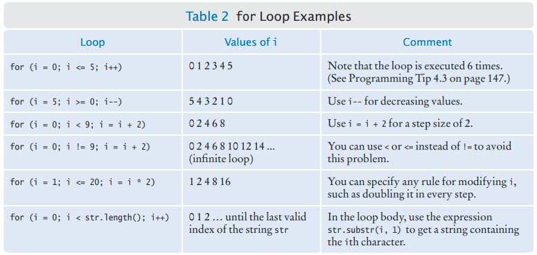

# C++ Notes

# C++ - The Basics

C++ is a high level object-oriented programing language.

Most C++ compilers require that C++ files end in an extension .cpp, .cxx, .cc, or .c.

C++ language is case sensitive.

## Library

A library is a collection of code that has been programmed and translated by someone else, ready for you to use in your program.

## Compiler

A compiler translates the written code into machine code.

## Linker

A linker takes your machine code and the necessary parts from the C++ library and builds an executable file.


## C++ skeleton code

```cpp
#include <iostream> //Preprocessor directive
using namespace std;
int main()
{
  // Enter code here
  return 0;
}
```


## C++ File Types

| File Type | File extension | Description |
| --- | --- | --- |
| Source code file | .cpp | Text file containing the c++ code. |
| Header file | .h | Text file containing information about other code files. |
| Object File | .obj | File containing object code. |
| Executable | .exe | Executable binary file. |

### What is object code?

Object code is a portion of machine code that has not yet been linked into a complete program.

## Preprocessor Directive

- This directs the compiler to include a source file before compiling the program.
- Generally used to include header files with extension .h. For example iostream.h.

### Explaining #include \<iostream\>

| Symbol | Description |
| :--: | :--: |
| \# | Preprocessor Directive |
| iostream | Header file provided by the C/C++ language for input/output processing |
| <> | Means that this file is available in a predefined directory |

## Escape Sequence

Backslash ' \ ' is used to print special characters.


## Errors

### Compile-Time Error or Syntax Error

Syntax errors occur when the compiler finds something wrong when it comes to the language rules i,e. syntax. When the compiler finds one or more errors, it will not translate the program to machine code.
If the compiler finds an error, it will not simply stop and give up. It will try to report as many errors as it can find, so you can fix them all at once.

### Run-Time Error

Run-Time error occurs when the program is syntactically correct  but it doesn’t do what it is supposed to do.
Because run-time errors are caused by logical flaws in the program, they are often called **logic errors**.
Run-time errors are more troublesome as the compiler will not be able to find them.

## Pseudocode

Pseudocode is a plain language description of the steps in an algorithm.
There are no strict requirements for pseudocode because it is read by human readers, not a computer program.

## ASCII (**American Standard Code for Information Interchange**)

[](https://www.lookuptables.com/text/ascii-table)

# Number System


[Basics of Computers - Number System](https://www.tutorialspoint.com/basics_of_computers/basics_of_computers_number_system.htm)

[Number System Conversion](https://www.tutorialspoint.com/basics_of_computers/basics_of_computers_number_system_conversion.htm)

[Real Numbers and Floating-Point Representation.pdf](data/3.1.3_Real_Numbers_and_Floating-Point_Representation.pdf)

## Writing Numbers in C++

- For Hexadecimal use: `\x`
- For Octal use: `\0`
- For decimal values use: `static_cast<char>()`

# Tokens

A token is the smallest element of a C++ program that is meaningful to the compiler.

The C++ compiler recognizes these kinds of tokens:

- Identifiers
- Keywords
- Constants/Literals
- Operators
- Punctuators
- Other Separators

[C++ Tokens | Keywords, Identifiers, Literals, Punctuators, Operators - cppforschool](http://www.cppforschool.com/tutorial/basic.html)

[C/C++ Tokens - GeeksforGeeks](https://www.geeksforgeeks.org/cc-tokens/)


## Identifiers

Identifiers are used as the general terminology for naming of variables, functions and arrays. Identifier names must differ in **spelling** and **case** from any keywords. You cannot use keywords as identifiers; they are reserved for special use. Once declared, you can use the identifier in later program statements to refer to the associated value

## Keywords

Keywords are pre-defined or reserved words in a programming language. Each keyword is meant to perform a specific function in a program. Since keywords are referred names for a compiler, they can’t be used as variable names because by doing so, we are trying to assign a new meaning to the keyword which is not allowed.

### Rules for naming identifier:

- It must begin with a letter or underscore(_).
- It must consist of only letters, digits, or underscore. No other special character is allowed.
- It should not be a keyword.
- It must not contain white space.
- It must not start with a digit.

## Literals

<!--  -->

### Decimal (Base 10)
  - Integer constant (eg: 25, -64, 0)
  - Floating point constant (eg: 2.34, -9.12, 1.2E10)

### Octal (Base 8)
  - Must begin with '0' (eg -12, 056)

### Hexadecimal (Base 16)
  - Must begin with '0x' (eg: 0x123)

### Character constant
  - Must be written with single quotes (eg: 'A', '$')

### String constant
  - Must be written with double quotes (eg: "LUMS")
  - Strings always end with a `\0` delimiter


### Literal vs Identifier (informal)
Literal is the **raw value** and identifier is the **name** of the variable or constant in which that raw value is stored.

## Operators

Operators are symbols that triggers an action when applied to variables and other objects.

### Arithmetic Operators

| Operator | Description |
| :--: | :--: |
| + | Addition |
| - | Subtraction |
| * | Multiplication |
| / | Division |
| % | Modulus |

### Increment and Decrement Operators

| Operator | Description |
| :--: | :--: |
| ++ | Increment |
| −− | Decrement |

### Relational Operators

| Operator | Description |
| :--: | :--: |
| == | Is equal to |
| != | Is not equal to |
| > | Greater than |
| < | Less than |
| >= | Greater than or equal to |
| <= | Less than or equal to |


### Logical Operators

| Operator | Description |
| :--: | :--: |
| && | And operator. Performs logical conjunction of two expressions.(if both expressions evaluate to True, result is True. If either expression evaluates to False, the result is False) |
| \|\| | Or operator. Performs a logical disjunction on two expressions.(if either or both expressions evaluate to True, the result is True) |
| ! | Not operator. Performs logical negation on an expression. |

### Bitwise Operators

Used on the **bits** of data.

| Operator | Description |
| :--: | :--: |
| << | Binary Left Shift Operator |
| != | Is not equal to |
| >> | Binary Right Shift Operator |
| ~ | Binary One's Complement Operator |
| & | Binary AND Operator |
| ^ | Binary XOR Operator |
| \| | Binary OR Operator |

### Assignment Operators

| Operator | Description |
| :--: | :--: |
| = | Assign |
| += | Increments, then assign |
| -= | Decrements, then assign |
| *= | Multiplies, then assign |
| /= | Divides, then assign |
| %= | Modulus, then assign |
| <<= | Left shift and assign |
| >>= | Right shift and assign |
| &= | Bitwise AND assign |
| ^= | Bitwise exclusive OR and assign |
| \|= | Bitwise inclusive OR and assign |


### Misc Operators

| Operator | Description |
| :--: | :--: |
| , | Comma operator |
| sizeOf() | Returns the size of a memory location |
| & | Returns the address of a memory location |
| * | Pointer to a variable |
| ? : | Conditional Expression |

### Operator Precedence

<!--  -->

<table>

<tbody><tr>
<th style="text-align: left"> Precedence
</th>
<th style="text-align: left"> Operator
</th>
<th style="text-align: left"> Description
</th>
<th style="text-align: left"> Associativity
</th></tr>
<tr>
<th> 1
</th>
<td> <code>::</code>
</td>
<td> <a href="https://en.cppreference.com/w/cpp/language/identifiers#Qualified_identifiers" title="cpp/language/identifiers">Scope resolution</a>
</td>
<td style="vertical-align: top" rowspan="6"> Left-to-right
</td></tr>
<tr>
<th rowspan="5"> 2
</th>
<td style="border-bottom-style: none"> <code>a++</code>&nbsp;&nbsp; <code>a--</code>
</td>
<td style="border-bottom-style: none"> Suffix/postfix <a href="https://en.cppreference.com/w/cpp/language/operator_incdec" title="cpp/language/operator incdec">increment and decrement</a>
</td></tr>
<tr>
<td style="border-bottom-style: none; border-top-style: none"> <code><i>type</i>()</code>&nbsp;&nbsp; <code><i>type</i>{}</code>
</td>
<td style="border-bottom-style: none; border-top-style: none"> <a href="https://en.cppreference.com/w/cpp/language/explicit_cast" title="cpp/language/explicit cast">Functional cast</a>
</td></tr>
<tr>
<td style="border-bottom-style: none; border-top-style: none"> <code>a()</code>
</td>
<td style="border-bottom-style: none; border-top-style: none"> <a href="https://en.cppreference.com/w/cpp/language/operator_other#Built-in_function_call_operator" title="cpp/language/operator other">Function call</a>
</td></tr>
<tr>
<td style="border-bottom-style: none; border-top-style: none"> <code>a[]</code>
</td>
<td style="border-bottom-style: none; border-top-style: none"> <a href="https://en.cppreference.com/w/cpp/language/operator_member_access#Built-in_subscript_operator" title="cpp/language/operator member access">Subscript</a>
</td></tr>
<tr>
<td style="border-bottom-style: none; border-top-style: none"> <code>.</code>&nbsp;&nbsp; <code>-&gt;</code>
</td>
<td style="border-bottom-style: none; border-top-style: none"> <a href="https://en.cppreference.com/w/cpp/language/operator_member_access#Built-in_member_access_operators" title="cpp/language/operator member access">Member access</a>
</td></tr>
<tr>
<th rowspan="10"> 3
</th>
<td style="border-bottom-style: none"> <code>++a</code>&nbsp;&nbsp; <code>--a</code>
</td>
<td style="border-bottom-style: none"> Prefix <a href="https://en.cppreference.com/w/cpp/language/operator_incdec" title="cpp/language/operator incdec">increment and decrement</a>
</td>
<td style="vertical-align: top" rowspan="10"> Right-to-left
</td></tr>
<tr>
<td style="border-bottom-style: none; border-top-style: none"> <code>+a</code>&nbsp;&nbsp; <code>-a</code>
</td>
<td style="border-bottom-style: none; border-top-style: none"> Unary <a href="https://en.cppreference.com/w/cpp/language/operator_arithmetic#Unary_arithmetic_operators" title="cpp/language/operator arithmetic">plus and minus</a>
</td></tr>
<tr>
<td style="border-bottom-style: none; border-top-style: none"> <code>!</code>&nbsp;&nbsp; <code>~</code>
</td>
<td style="border-bottom-style: none; border-top-style: none"> <a href="https://en.cppreference.com/w/cpp/language/operator_logical" title="cpp/language/operator logical">Logical NOT</a> and <a href="https://en.cppreference.com/w/cpp/language/operator_arithmetic#Bitwise_logic_operators" title="cpp/language/operator arithmetic">bitwise NOT</a>
</td></tr>
<tr>
<td style="border-bottom-style: none; border-top-style: none"> <code>(<i>type</i>)</code>
</td>
<td style="border-bottom-style: none; border-top-style: none"> <a href="https://en.cppreference.com/w/cpp/language/explicit_cast" title="cpp/language/explicit cast">C-style cast</a>
</td></tr>
<tr>
<td style="border-bottom-style: none; border-top-style: none"> <code>*a</code>
</td>
<td style="border-bottom-style: none; border-top-style: none"> <a href="https://en.cppreference.com/w/cpp/language/operator_member_access#Built-in_indirection_operator" title="cpp/language/operator member access">Indirection</a> (dereference)
</td></tr>
<tr>
<td style="border-bottom-style: none; border-top-style: none"> <code>&amp;a</code>
</td>
<td style="border-bottom-style: none; border-top-style: none"> <a href="https://en.cppreference.com/w/cpp/language/operator_member_access#Built-in_address-of_operator" title="cpp/language/operator member access">Address-of</a>
</td></tr>
<tr>
<td style="border-bottom-style: none; border-top-style: none"> <code>sizeof</code>
</td>
<td style="border-bottom-style: none; border-top-style: none"> <a href="https://en.cppreference.com/w/cpp/language/sizeof" title="cpp/language/sizeof">Size-of</a>
</td></tr>
<tr>
<td style="border-bottom-style: none; border-top-style: none"> <code>co_await</code>
</td>
<td style="border-bottom-style: none; border-top-style: none"> <a href="https://en.cppreference.com/w/cpp/language/coroutines" title="cpp/language/coroutines">await-expression</a> <span class="t-mark-rev t-since-cxx20">(C++20)</span>
</td></tr>
<tr>
<td style="border-bottom-style: none; border-top-style: none"> <code>new</code>&nbsp;&nbsp; <code>new[]</code>
</td>
<td style="border-bottom-style: none; border-top-style: none"> <a href="https://en.cppreference.com/w/cpp/language/new" title="cpp/language/new">Dynamic memory allocation</a>
</td></tr>
<tr>
<td style="border-top-style: none"> <code>delete</code>&nbsp;&nbsp; <code>delete[]</code>
</td>
<td style="border-top-style: none"> <a href="https://en.cppreference.com/w/cpp/language/delete" title="cpp/language/delete">Dynamic memory deallocation</a>
</td></tr>
<tr>
<th> 4
</th>
<td> <code>.*</code>&nbsp;&nbsp; <code>-&gt;*</code>
</td>
<td> <a href="https://en.cppreference.com/w/cpp/language/operator_member_access#Built-in_pointer-to-member_access_operators" title="cpp/language/operator member access">Pointer-to-member</a>
</td>
<td style="vertical-align: top" rowspan="12"> Left-to-right
</td></tr>
<tr>
<th> 5
</th>
<td> <code>a*b</code>&nbsp;&nbsp; <code>a/b</code>&nbsp;&nbsp; <code>a%b</code>
</td>
<td> <a href="https://en.cppreference.com/w/cpp/language/operator_arithmetic#Multiplicative_operators" title="cpp/language/operator arithmetic">Multiplication, division, and remainder</a>
</td></tr>
<tr>
<th> 6
</th>
<td> <code>a+b</code>&nbsp;&nbsp; <code>a-b</code>
</td>
<td> <a href="https://en.cppreference.com/w/cpp/language/operator_arithmetic#Additive_operators" title="cpp/language/operator arithmetic">Addition and subtraction</a>
</td></tr>
<tr>
<th> 7
</th>
<td> <code>&lt;&lt;</code>&nbsp;&nbsp; <code>&gt;&gt;</code>
</td>
<td> Bitwise <a href="https://en.cppreference.com/w/cpp/language/operator_arithmetic#Bitwise_shift_operators" title="cpp/language/operator arithmetic">left shift and right shift</a>
</td></tr>
<tr>
<th> 8
</th>
<td> <code>&lt;=&gt;</code>
</td>
<td> <a href="https://en.cppreference.com/w/cpp/language/operator_comparison#Three-way_comparison" title="cpp/language/operator comparison">Three-way comparison operator</a> <span class="t-mark-rev t-since-cxx20">(since C++20)</span>
</td></tr>
<tr>
<th> 9
</th>
<td> <code>&lt;</code>&nbsp;&nbsp; <code>&lt;=</code>&nbsp;&nbsp; <code>&gt;</code>&nbsp;&nbsp; <code>&gt;=</code>
</td>
<td> For <a href="https://en.cppreference.com/w/cpp/language/operator_comparison" title="cpp/language/operator comparison">relational operators</a> &lt; and ≤ and &gt; and ≥ respectively
</td></tr>
<tr>
<th> 10
</th>
<td> <code>==</code>&nbsp;&nbsp; <code>!=</code>
</td>
<td> For <a href="https://en.cppreference.com/w/cpp/language/operator_comparison" title="cpp/language/operator comparison">equality operators</a> = and ≠ respectively
</td></tr>
<tr>
<th> 11
</th>
<td> <code>&amp;</code>
</td>
<td> <a href="https://en.cppreference.com/w/cpp/language/operator_arithmetic#Bitwise_logic_operators" title="cpp/language/operator arithmetic">Bitwise AND</a>
</td></tr>
<tr>
<th> 12
</th>
<td> <code>^</code>
</td>
<td> <a href="https://en.cppreference.com/w/cpp/language/operator_arithmetic#Bitwise_logic_operators" title="cpp/language/operator arithmetic">Bitwise XOR</a> (exclusive or)
</td></tr>
<tr>
<th> 13
</th>
<td> <code>|</code>
</td>
<td> <a href="https://en.cppreference.com/w/cpp/language/operator_arithmetic#Bitwise_logic_operators" title="cpp/language/operator arithmetic">Bitwise OR</a> (inclusive or)
</td></tr>
<tr>
<th> 14
</th>
<td> <code>&amp;&amp;</code>
</td>
<td> <a href="https://en.cppreference.com/w/cpp/language/operator_logical" title="cpp/language/operator logical">Logical AND</a>
</td></tr>
<tr>
<th> 15
</th>
<td> <code>||</code>
</td>
<td> <a href="https://en.cppreference.com/w/cpp/language/operator_logical" title="cpp/language/operator logical">Logical OR</a>
</td></tr>
<tr>
<th rowspan="8"> 16
</th>
<td style="border-bottom-style: none"> <code>a?b:c</code>
</td>
<td style="border-bottom-style: none"> <a href="https://en.cppreference.com/w/cpp/language/operator_other#Conditional_operator" title="cpp/language/operator other">Ternary conditional</a>
</td>
<td style="vertical-align: top" rowspan="8"> Right-to-left
</td></tr>
<tr>
<td style="border-bottom-style: none; border-top-style: none"> <code>throw</code>
</td>
<td style="border-bottom-style: none; border-top-style: none"> <a href="https://en.cppreference.com/w/cpp/language/throw" title="cpp/language/throw">throw operator</a>
</td></tr>
<tr>
<td style="border-bottom-style: none; border-top-style: none"> <code>co_yield</code>
</td>
<td style="border-bottom-style: none; border-top-style: none"> <a href="https://en.cppreference.com/w/cpp/language/coroutines" title="cpp/language/coroutines">yield-expression</a> <span class="t-mark-rev t-since-cxx20">(C++20)</span>
</td></tr>
<tr>
<td style="border-bottom-style: none; border-top-style: none"> <code>=</code>
</td>
<td style="border-bottom-style: none; border-top-style: none"> <a href="https://en.cppreference.com/w/cpp/language/operator_assignment#Builtin_direct_assignment" title="cpp/language/operator assignment">Direct assignment</a> (provided by default for C++ classes)
</td></tr>
<tr>
<td style="border-bottom-style: none; border-top-style: none"> <code>+=</code>&nbsp;&nbsp; <code>-=</code>
</td>
<td style="border-bottom-style: none; border-top-style: none"> <a href="https://en.cppreference.com/w/cpp/language/operator_assignment#Builtin_compound_assignment" title="cpp/language/operator assignment">Compound assignment</a> by sum and difference
</td></tr>
<tr>
<td style="border-bottom-style: none; border-top-style: none"> <code>*=</code>&nbsp;&nbsp; <code>/=</code>&nbsp;&nbsp; <code>%=</code>
</td>
<td style="border-bottom-style: none; border-top-style: none"> <a href="https://en.cppreference.com/w/cpp/language/operator_assignment#Builtin_compound_assignment" title="cpp/language/operator assignment">Compound assignment</a> by product, quotient, and remainder
</td></tr>
<tr>
<td style="border-bottom-style: none; border-top-style: none"> <code>&lt;&lt;=</code>&nbsp;&nbsp; <code>&gt;&gt;=</code>
</td>
<td style="border-bottom-style: none; border-top-style: none"> <a href="https://en.cppreference.com/w/cpp/language/operator_assignment#Builtin_compound_assignment" title="cpp/language/operator assignment">Compound assignment</a> by bitwise left shift and right shift
</td></tr>
<tr>
<td style="border-top-style: none"> <code>&amp;=</code>&nbsp;&nbsp; <code>^=</code>&nbsp;&nbsp; <code>|=</code>
</td>
<td style="border-top-style: none"> <a href="https://en.cppreference.com/w/cpp/language/operator_assignment#Builtin_compound_assignment" title="cpp/language/operator assignment">Compound assignment</a> by bitwise AND, XOR, and OR
</td></tr>
<tr>
<th> 17
</th>
<td> <code>,</code>
</td>
<td> <a href="https://en.cppreference.com/w/cpp/language/operator_other#Built-in_comma_operator" title="cpp/language/operator other">Comma</a>
</td>
<td> Left-to-right
</td></tr></tbody></table>

[Source](https://en.cppreference.com/w/cpp/language/operator_precedence)


## Punctuators


# Some useful operators

## The MOD (%) operator

Modulus ( % ) gives us the remainder i.e. 5 % 2 = 1


### Separating Digits Using MOD (%)

```cpp
// Separating Last 4 Digits
int roll_number = 24100192; 

// THIS MULTIPLICATION IS VERY IMPORTANT
roll_number = roll_number % ((roll_number / 10000)*10000); 

cout << roll_number << endl;
// Output: 192
```

### MOD Separation Error

```cpp
// Separate Last 2 Character (i.e. Answer = 22)

int a = 222;
a = a % (a / 100); // Without Multiplication
cout << a << endl;
// Output: 0
a = 222;
a = a % ((a / 100)*100); // With Multiplication
cout << a << endl;
// Output: 22

// SO MAKE SURE YOU MULTIPLY
```

## The Division operator ( / ) (C++ specific)

Division ( / ) usually return the quotient value, or in other words if used with integers, will give answer in integers too i.e. 5 / 2 = 2.

If you want the result in decimal form you can do:

1. `5 / 2.0`
2. `(double)5 / 2` i.e. type casting
3. `double a = 5, b = 2, c; c = a / b` i.e. division on decimal defined values

## Increment and Decrement Operator

```cpp
++x; // increment first or pre increment
x++; // increment later ot post increment

// Example 1
x = 3;
y = ++x;
// x contains 4, y contains 4

// Example 2
x = 3;
y = x++;
// x contains 4, y contains 3

// Example 3 
x = 1;
y = x++ + 1;
// x contains 2, y contains 2

```

## The sizeof() operator

[Discussed here](#sizeof)


# Naming Convention for C++

| Object | Convention |
| :--: | :--: |
| Constants | ALL_CAPS, ALLCAPS |
| Variables | all_small, allsmall |
| Functions | firstSmallRestCamelCase |
| Classes | CamelCase |

[Google C++ Style Guide](https://google.github.io/styleguide/cppguide.html#Naming)

# Variable

An identifier whose value can be modified or changed.

## Variable definition and assignment

```cpp
int cans_per_pack = 6;
// Variable definition (declaration + assignment)

cans_per_pack = 8; 
// Assignment statement
```

You must define a variable before you use it for the first time.

## Using Uninitialized Variables

If you define a variable but leave it uninitialized, then your program can act unpredictably. If you use the variable without initializing it, then a default value will be used, yielding unpredictable results. For example, consider the program segment:

```cpp
int bottles; // Forgot to initialize
int bottle_volume = bottles * 2; // Result is unpredictable
```

# Constants

- An identifier whose value cannot be modified or changed. They are treated just like regular variables except that their values cannot be modified after their definition.
- Its better to use UPPERCASE for names of constant.
- A constant can be declared using the keyword `const` as:

```cpp
const int CANS_PER_PACK = 6;
const float PI = 3.14159;
const char FIRST_CH = 'c';
const string PREFIX = "LUMS";
```

# Comments

```cpp
const double CAN_VOLUME = 0.355; // Single line comment

/*
 This is a
 multiline comment
*/
```

# C++ Data Types

| Simple/Basic | Modifiers | Qualifiers | Derived (Structured) | Composite (Advanced) |
| :--: | :--: | :--: | :--: | :--: |
| char | signed | static | arrays | lists |
| int | unsigned | const | structures | queues |
| float | long | volatile | unions | stacks |
| double | - | void | classes | trees |
| - | - | - | - | graphs |

# Character (char)

`char` is used to store a single character within single quotes ( `' '` ).

```cpp
char x = 'x';
char z = '\n';
```

Char is actually an integer in the backend and can be used to make a program more efficient.

[Difference between signed / unsigned char](https://stackoverflow.com/questions/4337217/difference-between-signed-unsigned-cha)

# Numeric Types


[A better size chart here](https://docs.oracle.com/cd/E19253-01/817-6223/chp-typeopexpr-2/index.html)

## Can double hold store data than long?

Double is a floating point data type while long is an integral data type. The difference is in the manner of encoding number information.

The 64 bit double format based on IEEE754 standard has the following breakup:
  - Sign bit: 1 bit
  - Exponent width: 11 bits
  - Significant precision: 53 bits (52 explicitly stored)


[Source](https://en.wikipedia.org/wiki/Double-precision_floating-point_format)

The exponent gives double precision numbers a very large range - Negative numbers are in the range -1.79769e+308 to -2.22507e-308 and positive numbers are in the range 2.22507e-308 to 1.79769e+308.

The large range comes at the cost of decreased precision though.

64bit long in contrast has a simple encoding, it is represented as a string of bits in the binary numeral system. These can range from −2^63 to 2^63 − 1 in the signed case. Or from 0 to 2^64 -1 in the unsigned case.

Note that 'long' may imply either 32 bit or 64 bit depending on the context. Im assuming you mean 64bit long here.

## Numeric Ranges, Precisions and Overflows

Because numbers are represented in the computer with a limited number of digits, they cannot represent arbitrary integer or floating-point numbers.  All data type have a limited range. 

If a computation yields a value that is outside the `int` range, the variable will **overflow**. 

If a variable is currently at the highest possible value it can store, and you add 1 to it, it will cycle back to the smallest possible value.

For floating-points, a computer can not store the exact value of a fraction and can only store a close approximation. This is called **Roundoff Error**. How precise that approximation, depends on the size of the data type.

## Calculating range of a 32bit integer

<!---

<p align="center">

</p>

<p align="center">

</p>
-->

```latex
$$-\frac{2^{32}}{2} \iff 0 \iff \frac{2^{32}}{2}-1$$

$$-2147483648 \iff 0 \iff 2147483647$$
```
> 0 is considered a positive number. Thus, 1 is subtracted from the total number of positive integers when calculating total range of positive numbers.

## Storing floats in int

```cpp
// int just ignores everything after the decimal - truncation
int x = 2.7523532425; 
// x = 2
int x = 2.023532425; 
// x = 2
```

## Defining a float variable

```cpp
float = 2.45f;
// the f at the end is necessary, else the compiler will change the float to a double
```

# sizeof()

The `sizeof` is a keyword, but it is a compile-time operator that determines the size, in bytes, of a variable or data type.

The sizeof operator can be used to get the size of classes, structures, unions and any other user defined data types.

It is mainly used to get size of arrays.

```cpp
#include <iostream>
using namespace std;
 
int main() {
   cout << "Size of char : " << sizeof(char) << endl;
   cout << "Size of int : " << sizeof(int) << endl;
   cout << "Size of short int : " << sizeof(short int) << endl;
   cout << "Size of long int : " << sizeof(long int) << endl;
   cout << "Size of float : " << sizeof(float) << endl;
   cout << "Size of double : " << sizeof(double) << endl;
   cout << "Size of wchar_t : " << sizeof(wchar_t) << endl;
   
   return 0;
}
/*
Size of char : 1
Size of int : 4
Size of short int : 2
Size of long int : 4
Size of float : 4
Size of double : 8
Size of wchar_t : 4
*/
```


# static_cast()

`static_cast` is used to convert data types.

```cpp
// static_cast < new_type > ( expression )
int n = static_cast<int>(3.14);
```

# Input and Output


`cin` only reads one word. 

Example if you try to input `Double Word` with `cinn` only `Double` will be used. 

To take multiword inputs use `getline()`.

```cpp
string city;
getline(cin, city);
// read till the end of the line and store it in the variable city
```

# Formatted Outputs

- `fixed` - write floating point values in fixed point notation.
- `scientific` - write floating point values in scientific notation.
- `setprecision()` - set floating point precision to n decimal places.
- `setw()` - set width to n columns.
- `setfill()` - use a specific character to fill a width (specified by `setw()`).

> use iomanip header to get access to setw() and setprecision()

## Examples:


## setprecision() examples

```cpp
int main () {
  double f =3.14159;
  std::cout << std::setprecision(5) << f << endl;
  std::cout << std::setprecision(9) << f << endl;
  std::cout << std::fixed;
  std::cout << std::setprecision(5) << f << endl;
  std::cout << std::setprecision(9) << f << endl;
  return 0;
}
/*
3.1416 // 5 digits
3.14159
// fixed specified here
3.14159 // fixed makes it so that 5 characters are printed after decimal
3.141590000 // here 9 digits are printed after the decimal
*/
```

## `setw()` & `setfill()` example:

```cpp
int main()
{
    cout << setfill(' ') << setw(15) << "" << setfill ('*') << setw (3) << "" << setfill(' ') << setw(15) << "" << endl;
    cout << setfill(' ') << setw(13) << "" << setfill ('*') << setw (7) << "" << setfill(' ') << setw(13) << "" << endl;
    cout << setfill(' ') << setw(11) << "" << setfill ('*') << setw (11) << "" << setfill(' ') << setw(11) << "" << endl;
    cout << setfill(' ') << setw(0) << "" << setfill ('*') << setw (33) << "" << setfill(' ') << setw(0) << "" << endl;
    cout << setfill('*') << setw(8) << "" << setfill (' ') << setw (17) << "" << setfill('*') << setw(8) << "" << endl;

    cout << "  " << setfill('*') << setw(8) << "" << setfill (' ') << setw (13) << "" << setfill('*') << setw(8) << "" << "  " << endl;
    cout << setfill('*') << setw(8) << "" << setfill (' ') << setw (17) << "" << setfill('*') << setw(8) << "" << endl;

    cout << setfill(' ') << setw(0) << "" << setfill ('*') << setw (33) << "" << setfill(' ') << setw(0) << "" << endl;
    cout << setfill(' ') << setw(11) << "" << setfill ('*') << setw (11) << "" << setfill(' ') << setw(11) << "" << endl;
    cout << setfill(' ') << setw(13) << "" << setfill ('*') << setw (7) << "" << setfill(' ') << setw(13) << "" << endl;
    cout << setfill(' ') << setw(15) << "" << setfill ('*') << setw (3) << "" << setfill(' ') << setw(15) << "" << endl;
    return 0;
}
/*
               ***               
             *******             
           ***********           
*********************************
********                 ********
  ********             ********  
********                 ********
*********************************
           ***********           
             *******             
               ***
*/
```

```cpp
int main()
{
    cout << setfill(' ') << setw(4) << "" << setfill('*') << setw(1) << "" << setfill(' ') << setw(4) << "" << endl;
    cout << setfill(' ') << setw(3) << "" << setfill('*') << setw(3) << "" << setfill(' ') << setw(3) << "" << endl;
    cout << setfill(' ') << setw(2) << "" << setfill('*') << setw(5) << "" << setfill(' ') << setw(2) << "" << endl;
    cout << setfill(' ') << setw(1) << "" << setfill('*') << setw(7) << "" << setfill(' ') << setw(1) << "" << endl;
    cout << setfill(' ') << setw(0) << "" << setfill('*') << setw(9) << "" << setfill(' ') << setw(0) << "" << endl;
    return 0;
}

/*
Output:
    *
   ***
  *****
 *******
*********
*/
```

# String

- To use string include the header file string: `#include <string>`
- Given two strings, such as "Harry" and "Morgan", you can concatenate them to one long string.

```cpp
string fname = "Harry";
string lname = "Morgan";
string name = fname + lname;
//"HarryMorgan"
```

## What is a string literal?

String literal is the raw string value like "hello".

Remember: Two string literals can not be concatenated.
However, a string literal can be concatenated with a variable with a string\char data type.

## String Functions


# Comparison Operators


## Comparison Examples


# If Else statement

```cpp
if ( a < 20 ) 
{
  // if condition is true then print the following
  cout << "a is less than 20;" << endl;
}
else if ( a > 30)
{
  cout << "a is more than 30;" << endl;
}
else
{
  cout << "a is between 20 and 30;" << endl;
}


// if you have only one statement after if you can skip the {}
if ( 5 < 10 )
  cout<<"Five is now less than ten, that's a big surprise";
```

## Dangling Else

Dangling else can cause issues and can be quite difficult to debug.

```cpp
if(x == 1)
	if(x == 2)
		if(x > 2)
else //this else belongs to if(x > 2)
{
	//code
}
```

## Dynamic Declaration (C++17)

```cpp
if (int k = 5; k < 10)
{
  // k will only be useable inside 'the if' code block
}

```

# Conditional operator

```cpp
//condition ? true value : false value
actual_floor = floor > 13 ? floor - 1 : floor;
```


# Optimization while performing comparisons (Short Circuit)

C++ optimizes the comparisons by only running half of the comparisons. 

For example in `x && b` if `x` is false, the output of the comparison will be false no matter what the value of `b` is and so c++ will not even check the value of `b`. However, if `x` is true then c++ will check the value for `b` as now the output also depends on the value of `b`. 

In case of `x || b` if `x` is true, the output of the comparison will true no matter what the value of `b` is and so c++ will not check the value of `b`. But if the value of `x` is false, now the output will depend on the value of `b`. 

Analyze the following code:

```cpp
bool yes()
{
  cout << "yes";
  return true;
}

bool no()
{
  cout << "no";
  return false;
}

int main()
{
yes() || no(); // output: yes
no() || yes(); // output: noyes
yes() || yes(); // output: yes
}
```

# De Morgan's Law

```latex
$$! \; (A \; \&\& \; B)  == \; !A \; || \; !B$$
```

# Comparison of Floating-Point Numbers

Exact Comparison of Floating-Point Numbers Floating-point numbers have only a limited precision, and calculations can introduce roundoff errors.

Use the following equation to compare the Floating-Point Number:

```latex
$$|x-y|<\epsilon$$
```

```cpp
double x = 2.0;
double y =  sqrt(x);

// x = 2.00000000000000000000
// y*y = 2.00000000000000044409

// Wrong way to compare

if (x == y*y)
	cout << "Comparison Working" << endl;
else
	cout << "Comparison Not Working" << endl;

// Output:
// Comparison Not Working

// Right way to compare

double epsilon = 1E-14;
if ( fabs(x - y*y) < epsilon )
	cout << "Comparison Working" << endl;
else
	cout << "Comparison Not Working" << endl;

// Output:
// Comparison Working
```

# Comparing Strings

C++ uses Lexicographic Ordering of Strings. This ordering is very similar to the way in which words are sorted in a dictionary.

The easier way to look at it is to just use the ASCII table for comparisons. The character with the lower ASCII value will be less than the character with  higher ASCII value.

Also, longer words have a value higher than lower words.

# Switch Statement

```cpp
int digit = 4;
string digit_name;

switch (digit)
{
 case 1: digit_name = "one"; break; // if digit == 1
 case 2: digit_name = "two"; break;
 case 3: digit_name = "three"; break;
 case 4: digit_name = "four"; break;
 case 5: digit_name = "five"; break;
 case 6: digit_name = "six"; break;
 case 7: digit_name = "seven"; break;
 case 8: digit_name = "eight"; break;
 case 9: digit_name = "nine"; break;
 default: digit_name = ""; break;
}

cout << digit_name << endl;
// four
```


# Flowcharts Basic


## Flowchart example

```cpp
cout << "Enter an integer greater than 1: "; 
int num; 
cin >> num; 

int i = 2;
bool pr = true; 
while (i <= num / 2) 
{ 
	if (num % i == 0)
	{ 
		pr = false; 
	}
  ++i;
} 
if (pr) 
	cout << "This is a prime number";
else cout << "This is not a prime number";
```


# cin.fail()

`cin.fail()` is used for Input Validation. Below is an example implementation:

```cpp
int x = 0;
cin >> x;

if (cin.fail())
{
	cout << "Error: Not an integer." << endl;
	return 1; // used when the program closes due to an error
} else
{
	cout << "Input was accepted" << endl;
	return 0;
}
```

# Clearing Input Failure State

When an input operation has failed, all further input operations also fail. If you want to read two number sequences and use a letter as a sentinel, you need to clear the failure state after reading the first sentinel. Call the `cin.clear()` function.

```cpp
int values;
cout << "Enter values, Q to quit.\n";
while (cin >> values)
{
	// Process input.
}
cin.clear(); // removes errror flag

// Suppose the user has entered 30 10 5 Q. 
// The input of Q has caused the failure. Because 
// only successfully processed characters are 
// removed from the input, the Q character is 
// still present. Read it into a dummy variable.

string sentinel;
getline(cin, sentinel); // inplace of this you can also use cin.ignore(1000, '\n');

// every input after this will work fine
```

The `cin.clear()` clears the **error flag** on cin so that future I/O operations will work correctly.

NOTE: `cin.clear()` and storing the cin's data in a dummy variable have separate purposes. Also see `cin.ignore()` and `cin.flush()`.

[ios::clear - C++ Reference](http://www.cplusplus.com/reference/ios/ios/clear/)

[istream::ignore - C++ Reference](http://www.cplusplus.com/reference/istream/istream/ignore/)


# Enumerations

[Enums - Youtube](https://www.youtube.com/watch?v=x55jfOd5PEE)

```cpp
enum Colors {RED , ORANGE, BLUE};

// RED = 0
// ORANGE = 1
// BLUE = 2

Colors mycolor = RED;
int x = 0;

if ((Colors)x == mycolor)
  cout << "mycolor is RED" << endl;
else
  cout << "mycolor is not RED" << endl;
```

You can also force indexed:

```cpp
enum Colors {RED=1 , ORANGE, BLUE};
// RED = 1
// ORANGE = 2
// BLUE = 3
```

# Typedef

Used to create user-defined data types. 

With `typedef` you can rename a primitive data types to improve code readability.

```cpp
typedef int age;
// defining a new data type age, which is actually int at its core

age a1 = 16;
age a2 = 18;
// you can use the custom datatype just like any other primitive data type
```

# While Loop


## While Loop Examples


# For Loop


## For Loop Examples



## Inner Workings of a for loop

```cpp
// for (a, b ,c) { body }

// 1. a will run at the start
// 2. b will run
// 3. loop body will run
// 4. c will run
// 5. b will run
// 6. loop body will run
// 7. c will run
// 8. b will run
// and so on..

```

## Different Shapes of For Loops

```cpp
// ***************
for (int i = 0; i < 5 ; i++)
{
  cout << i;
}
// Output: 01234

// ***************
int i = 0;
for (; i < 5 ; i++)
{
  cout << i;
}
// Output: 01234

// ***************
int i = 0;
for (; ; i++)
{
  if ( i >= 5) { break; }

  cout << i;
}
// Output: 01234

// ***************
int i = 0;
for (; ;)
{
  if ( i >= 5) { break; }
  
  cout << i;
  i++;
}
// Output: 01234
```

# Do While Loop

Do While Loop is a modification of the While Loop.

The do loop is appropriate when the loop body must be executed at least once.

```cpp
do
{
 // statements
}
while (x > 0); // condition
```

# Loop and a Half


# `break` and `continue`

`break` statement breaks the loop while the `continue` statement goes to the next iteration o the loop.

# Random Numbers

`rand()` is used to generate random numbers.

Use `ctime` for seed generation.

```cpp
// Generating 10 random numbers between 0 and 6

srand(time(0)); // setting seed
int number = 0;

for (int i = 0; i < 10; i++)
{
	number = rand() % 6 + 1;
	cout << number << endl;
}
```

```cpp
// Generating 10 random decimals between 0 and 1

srand(time(0));
double number = 0;

for (int i = 0; i < 10; i++)
{
	number = rand() * 1.0 / RAND_MAX; // multiply by 1.0 to convert
	cout << number << endl;           // the calculation to double.
}

```

# Functions

Functions are viewed as a black box. We put in value and we get some other value or in case of void functions we perform a task.

The whole idea of a function is to break down the program into smaller parts and to reuse those smaller parts if needed.


## Flowchart representation of functions


## Ignoring return statement

Most compilers will issue a warning if a return statement is missed, but if you ignore the warning and the function is ever called, a **random quantity** will be returned. This could produce unpredictable behaviors.

## Function Declaration vs Definition

```cpp
// Declaration of cube_volume
double cube_volume(double side_length); // function head

int main()
{
	cube_volume(6); // function used
	return 0;
}

// Definition of cube_volume
double cube_volume(double side_length) // function head
{
 return side_length * side_length * side_length; // function body
}
```

If you declare the define the function below the `main()` function, the compiler will not be able to find the function declaration and will not compile.
To fix this, put the function declaration above the `main()`function, and put the function definition after the `main()` function.

A drawback: Whenever you change the name of a function or one of the parameter types, you need to fix it in both places: in the declaration and in the definition.

## Function Comments

You should describe your functions using comments.

```cpp
/*
 Computes the volume of a pyramid whose base is a square.
 @param height the height of the pyramid
 @param base_length the length of one side of the pyramid’s base
 @return the volume of the pyramid
*/
double pyramidVolume(double height, double base_area)
{
	return (height * base_area)/3;
}
```

## Void Functions & Procedures

Function that don't return a value are `void` functions. 

Void functions are also called **procedures**.

## Reference Parameters

If you want to write a function that changes the value of an argument, you must use a reference parameter (`&`) in order to allow the change.

```cpp
void increment(int& n)
{
  n++;
}

int main()
{
  int num = 1;
  cout << "Before: " << num << endl;
  increment(num);
  cout << "After: " << num << endl;

}
/*
Output:
Before: 1
After: 2
*/
```

## Constant References

Using simple parameter variable is less efficient than using a reference parameter.

With a reference parameter, only the location of the variable, not its value, needs to be transmitted to the function.

```cpp
int sum(const int& a, const int& b) // Just add const
{
  return a+b;
}

int main()
{
  int num1 = 4;
  int num2 = 6;
  cout << "Sum: " << sum(num1, num2) << endl; 
}

// Output:
// Sum: 10
```

# Variable Scope

- A variable that is defined **within a function** is visible from the point at which it is defined until the end of the block in which it was defined. This area is called the scope of the variable.
- It is not legal to define two variables with the same name in the same scope.

## Global Variable vs Local Variable

Global variable is visible to the whole file, while local variables are function specific.

```cpp
double pi = 3.142; // Global Variable

double circumferenceOfCircle(int radius)
{
	return 2 * pi * radius; // Global Variable Used
}

int main()
{
	int r = 34; // Local Variable
	cout << "Radius: " << r << endl;
	cout << circumferenceOfCircle(r) << endl;
}
```

> **DONT USE GLOBAL VARIABLES**

## Other type of scopes

- Block Scope (local within a block of code):

    A variable whose scope is just a small block of code. E.g `i` in for loops:

    ```cpp
    for(int i = 0; i < 5; i++) 
    {
    	// i is only useable here
    }
    ```

- Function scope (local within a block of function):

    A variable which is only useable inside a function.

- File scope:

    A variable which is only useable inside a file.

- Program scope:

    A variable which is only useable inside a program. 


# Static Variables

Usually variables are destroyed after a code block finishes execution but if we define a variable, in that block, as static, it will not be destroyed.

Static elements are allocated storage only once in a program lifetime in static storage area. And they have a scope till the program lifetime.

```cpp
void counter()
{
    static int count=0;
    cout << count++;
}

int main()
{
    for(int i=0;i<5;i++)
    {
        counter();
    }
}
// Output:
// 01234
```

# Arrays

Array is the collection of items of same type in contiguous memory.

## Defining an Array

The array size must be **constant**.


## `sizeof()` on arrays

Using `sizeof()` on arrays will return the total bytes needed to store that array.

```cpp
int arr[5] = {1, 2, 3, 4, 5};

cout << sizeof(arr) << endl; // 20
cout << sizeof(arr[0]) << endl; // 4
```

## Reading out of bound array

If you try to print an out of bound index of an array, the compiler will **not complain,** it **will compile** but the **output** will be **unpredictable**.

```cpp
int arr[2] = {1, 2 };
cout << arr[0] << endl;
cout << arr[1] << endl;
cout << arr[2] << endl;
/*
Output:
1
2
4196448
*/
```

# Arrays and Functions

```cpp
double sum(double values[], int size) // passing in size is important
{
	double total = 0;
	for (int i = 0; i < size; i++)
	{
		total = total + values[i];
	}
 return total;
}
```

> Note that array parameters are always **reference parameters.**


## Constant Array Parameters

When a function doesn’t modify an array parameter, it is considered a good style to add the `const` reserved word, like this:

`double sum(const double values[], int size)`

The `const` reserved word helps the reader of the code, making it clear that the function keeps the array elements unchanged. If the implementation of the function tries to modify the array, the compiler issues a warning.

# Common Array Algorithms

## Filling an array

```cpp
const int SIZE = 5;
int squares[SIZE];

for(int i = 0; i < SIZE; i++)
{
  squares[i] = i * i;
}
```

## Filling an array with user inputs

```cpp
const int SIZE = 5;
int squares[SIZE];

for(int i = 0; i < SIZE; i++)
{
  cin >> squares[i];
}
```

## Copying a reversed array

```cpp
const int SIZE = 5;
int arr[SIZE] = {1, 2, 3, 4, 5};
int reversed_arr[SIZE];

for(int i = 4; i >= 0; i--)
{
  reversed_arr[4-i] = arr[i];
}
/*
Output:
arr: 1   2   3   4   5
reversed_arr: 5   4   3   2   1
*/
```

## Removing an element

```cpp
int removeElement(int arr[], int size, int index)
{
  for (int  i = index; i <= size-1; i++)
  {
    arr[i] = arr[index + 1];
  }
  arr[size-1] = -1;
  return size - 1; // its better to return the new size
}

int main()
{
const int SIZE = 5;
int arr[SIZE] = {1, 2, 3, 4, 5};

removeElement(arr, SIZE, 3);
}

/*
Output:
arr: 1   2   3   5   -1
*/
```

## Inserting an element

```cpp
int insertElement(int arr[], int size, int index, int value)
{
	if (index >= 0 && index < size) // it is better to have a condition that checks index
	{
	  for(int i = size - 1; i > index ; i--)
	  {
	    arr[i] = arr [i - 1];
	  }
	  arr[index] = value;
	  return size + 1;
	}
	else
	{
		return size;
	}
}

int main()
{
const int SIZE = 10;
int arr[SIZE] = {1, 2, 3, 4, 5};

insertElement(arr, SIZE, 2, 345);
}
/*
Output:
arr: 1   2   345 3   4   5   0   0   0   0
*/
```

## Sorting an array (my algorithm)

```cpp
void sort(int arr[], int size)
{
	int temp = 0;
  for(int i = 0; i < size-1; i++)
  {
    if(arr[i] > arr[i+1])
      {
	       temp = arr[i];
	       arr[i] = arr[i+1];
         arr[i+1] = temp;
         i = -1; //reset
      }
  }
}

int main()
{
const int SIZE = 5;
int arr[SIZE] = {-1, -32, 33, 454, 15};

sort(arr, SIZE);
}
/*
Output:
arr: -32 -1  15  33  454
*/
```

## Selection Sort

[Selection Sort - GeeksforGeeks](https://www.geeksforgeeks.org/selection-sort/)

## Binary Search

[Binary Search - GeeksforGeeks](https://www.geeksforgeeks.org/binary-search/)


# Multi-Dimensional Array


## Multiplication of matrices (Example)

[C++ Program to Multiply Two Matrix Using Multi-dimensional Arrays](https://www.programiz.com/cpp-programming/examples/matrix-multiplication)


# Pointers

[POINTERS in C++ - Youtube](https://www.youtube.com/watch?v=DTxHyVn0ODg)


```cpp
int x = 1000; // a variable x storing the value 1000
int* px = &x; // a pointer px storing the memory address of variable x
```

References are managed by the compiler but pointers are directly managed by the programmer.


## Initializing a Pointer

- When you initialize a pointer, be sure that the pointer and the memory address have the same type.
- If you define a pointer variable without providing an initial variable, the pointer contains a random address. Using that random address is an error. To prevent this initialize a pointer with the value NULL : `int* px = NULL`

## Pointer and Reference Parameters


## Constant Pointers


# Array and pointers

The name of the variable storing an array actually stores the **starting address** of that array.

```cpp
int arr[5] = {};

cout << arr << endl; // Output: 0x7ffd9bcdc160 (i.e. address)
```

Because array is continuous space in memory, you can access its content through pointers. 

```cpp
int arr[5] = {1, 2, 3, 4, 5};
int* p = arr;

cout << arr << endl;
cout << p << endl;
cout << *arr << endl;
cout << *p << endl;

/*Output:
0x7ffff9686530
0x7ffff9686530
1
1
*/

```


## Pointer Arithmetic

Pointer arithmetic means adding an integer offset to an array pointer, yielding a pointer that skips past the given number of elements.

```cpp
double a[10];
double* p = a;

// *(p + 3) == a[3]
```

## Array/Pointer Duality Law

This law explains why all C++ arrays start with an index of zero. The pointer a (or a + 0) points to the starting element of the array. That element must therefore be a[0]. To better understand pointer arithmetic, let’s again pretend that we know actual memory addresses. Suppose the array a starts at address 20300. The array contains 10 values of type double. A double value occupies 8 bytes of memory. Therefore, the array occupies 80 bytes, from 20300 to 20379. The starting value is located at address 20300 the next one at address 20308, and so on.

```latex
$$a[n] == *(a+n)$$
```

## Using Pointer Arithmetic to print an Array

```cpp
int arr[5] = {1, 2, 3, 4, 5};
int* p = arr;

for(int i = 0 ;i < sizeof(arr)/sizeof(int); i++)
{
  cout << *(p+i) << endl;
}
```

## Passing array to a function using pointers

```cpp
void printarray1(int* arr, int size)
{
  cout << "[";
  for (int i = 0; i < size; i++)
  {
    cout << *(arr + i) << ", ";
  }
  cout << "\b\b]" << endl;;
}

int main()
{
  int arr[5] = {2, 3, 5 ,6, 3};

  printarray1(arr, 5);
}

// Output:
// [2, 3, 5, 6, 3]
```

# Char Pointers (C-Strings)

C language stores strings in `char*` which are quite similar to `char[]`. A string stored in a char* is called a 'c-string'. `string.h` is used to work with c-strings.

A c-string can be declared with the following command: 
```cpp
const char* string = "Harry";
//The `char*` must be a constant.
```

C++ uses the `string` datatype to store strings.

> If you are programming in c++, it is recommended to not use c-string (or any c function).


## char[] and char* and strings

[char* vs std:string vs char[] in C++ - GeeksForGeeks](https://www.geeksforgeeks.org/char-vs-stdstring-vs-char-c/)

[Difference between char and char* in c - StackExchange](https://cs50.stackexchange.com/questions/8899/difference-between-char-and-char-in-c)

In the backend a `char*` is:
  - `char[]` in C
  - `const char[]` in C++

A weird behavior of char*:
```cpp
/*  Will work */
const char backend_char_array[] = "abc";
const char *c = backend_char_array;
c = "Lorem ipsum dolor sit amet";

/*  Will give error */
char char_arr[] = "abc";
char_arr = "Lorem";
```

## Null Terminator

Null terminator `\0` is a character which tells the compiler the point where the string ends. 

For example a `"CS100"` in its array form is `['C', 'S', '1', '0', '0', '\0']`. As you can see, a 5 character long string requires an array of size 6.

### A function using Null Terminator

```cpp
// returns length of the string
int length(const char* string)
{
  int i = 0;
  // while(sting[i] != '\0')
  while(*(string + i) != '\0')
  {
    i++;
  }
  return i;
}

int main()
{
  const char* string = "CS100";
  cout << length(string) << endl;
}

// 5
```


# C++ strings and the [] Operator

C++ strings can be treated as arrays.

```cpp
string  word = "CS100";
cout << word << endl;
word[0] = 'S';
cout << word << endl; // SS100
```

# Dynamic Memory Allocation

The new operator allocates memory from the heap.  When you ask for a `new double` a storage location of type double is located on the heap, and a pointer to that location is returned.

You must reclaim dynamically allocated objects with the delete or delete[] operator or else you may face a memory leak.


## Dangling Pointers

